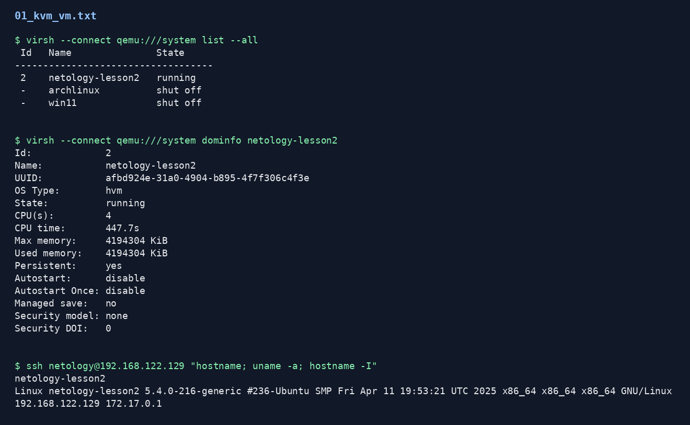
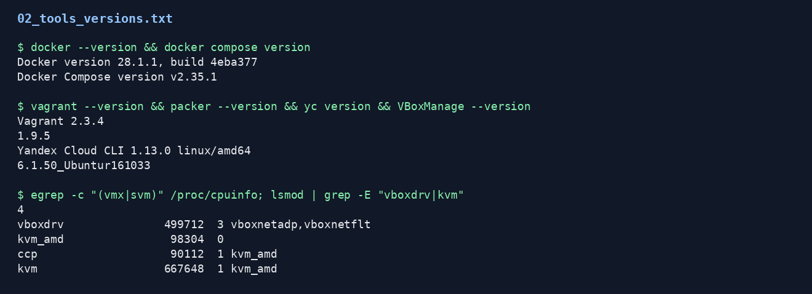
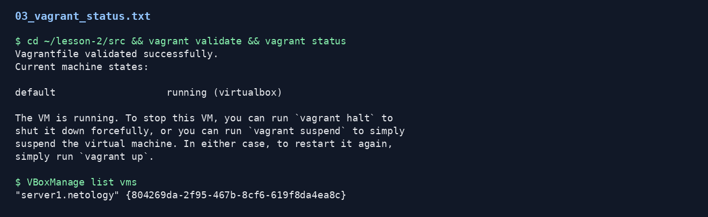
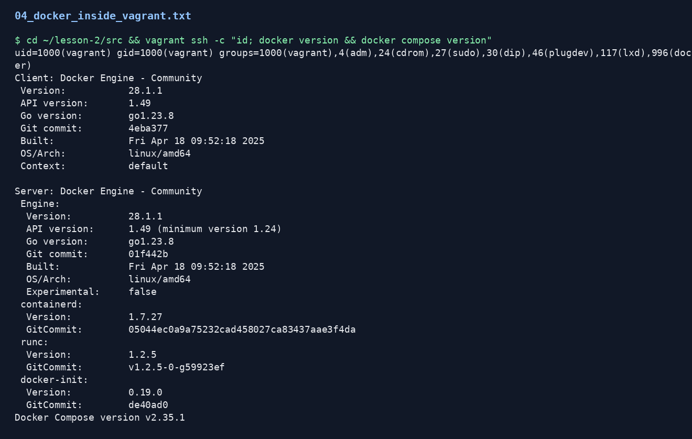
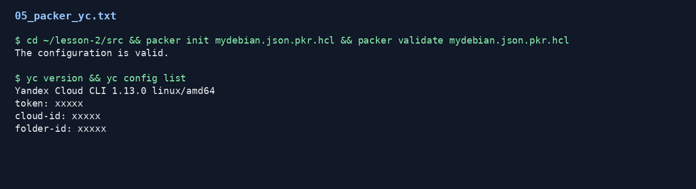

# Домашнее задание к занятию 2. Применение принципов IaaC в работе с виртуальными машинами

## Кратко

Работа выполнена в отдельной учебной виртуальной машине `netology-lesson2` на KVM/QEMU, чтобы не устанавливать учебные инструменты в рабочую систему хоста.

Внутри учебной VM подготовлена Ubuntu 20.04 и установлены:

- Docker и Docker Compose;
- VirtualBox;
- Vagrant 2.3.4;
- Packer 1.9.5;
- Yandex Cloud CLI.

Дополнительно создана вложенная VM через Vagrant/VirtualBox и внутри нее проверена установка Docker.

## Исходная VM для обучения

Учебная VM создана в KVM/QEMU:

- имя: `netology-lesson2`;
- ОС: Ubuntu 20.04;
- CPU: 4;
- RAM: 4 GB;
- диск: 30 GB;
- IP: `192.168.122.129`.



## Установленные инструменты

Проверены версии Docker, Docker Compose, Vagrant, Packer, YC CLI и VirtualBox. Также проверено наличие вложенной виртуализации и загруженных модулей VirtualBox/KVM.



## Задача 2. Vagrant и VirtualBox

В директории `src` создан `Vagrantfile`. Команда `vagrant validate` завершилась успешно. Вложенная VM `server1.netology` запущена через VirtualBox внутри учебной KVM VM.



После запуска Vagrant VM выполнена проверка Docker:

```bash
docker version && docker compose version
```

Команда выполнена внутри вложенной VM от пользователя `vagrant`.



## Задача 3. Packer и Yandex Cloud

Создан файл `src/mydebian.json.pkr.hcl`. В Packer provisioner добавлена установка:

- Docker Engine;
- Docker CLI;
- Docker Compose plugin;
- `htop`;
- `tmux`.

Секретные значения заменены на `ххххх`, чтобы не публиковать OAuth token, `folder_id` и другие чувствительные данные.

Проверка Packer-конфигурации:

```bash
packer init mydebian.json.pkr.hcl
packer validate mydebian.json.pkr.hcl
```

Также проверена работа YC CLI с безопасной заглушкой профиля.



## Файлы

- `src/Vagrantfile` - конфигурация Vagrant VM с установкой Docker.
- `src/mydebian.json.pkr.hcl` - Packer-конфигурация для образа Debian в Yandex Cloud.
- `evidence/*.txt` - полные текстовые выводы команд.
- `screenshots/*.png` - скриншоты выводов команд для отчета.

Исходный `README.md` с текстом задания добавлен в `.gitignore` и не предназначен для публикации как решение.
