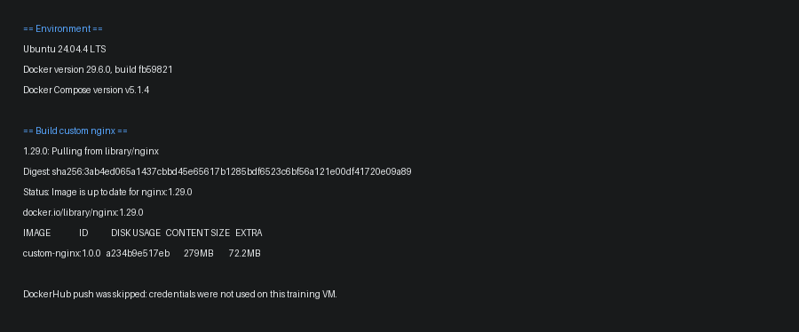
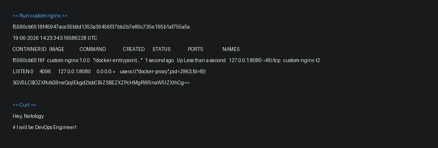
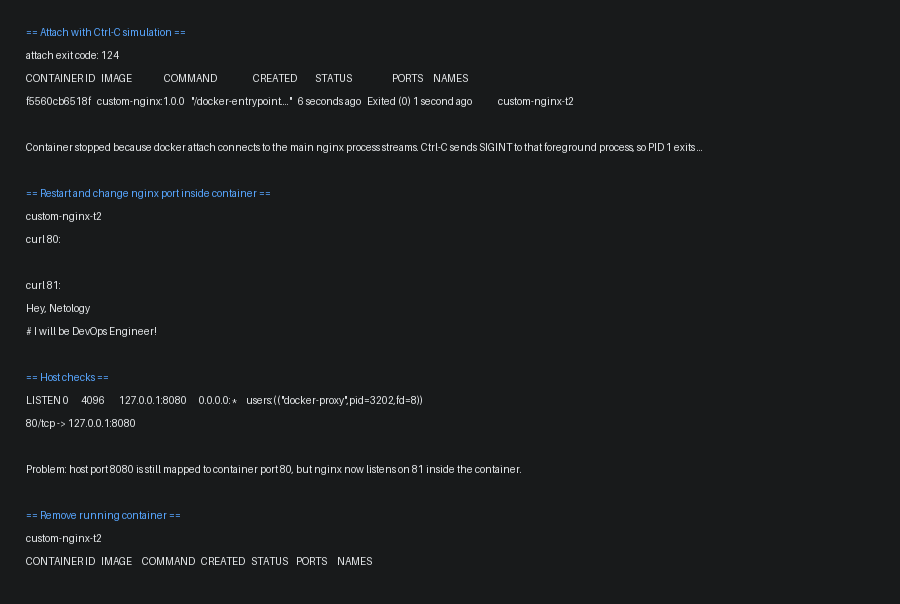
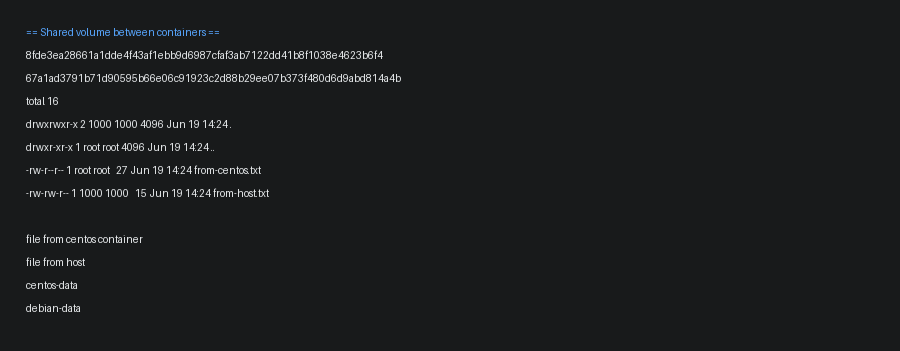
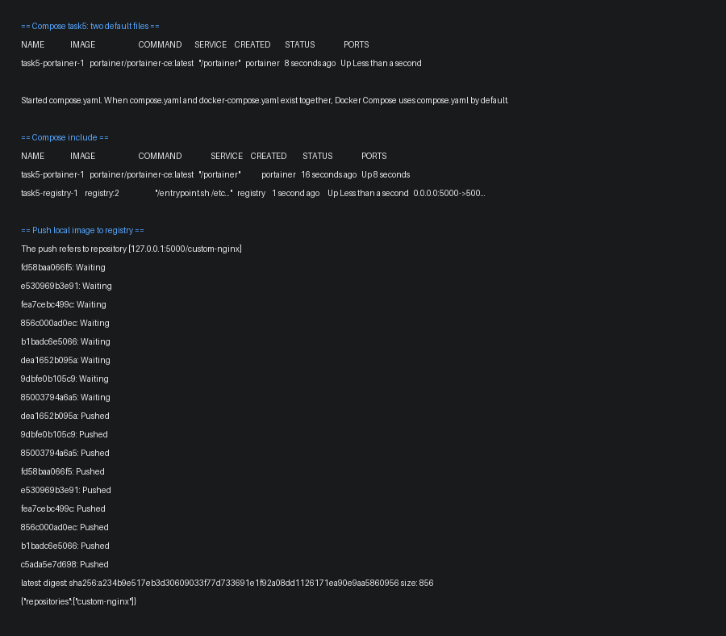
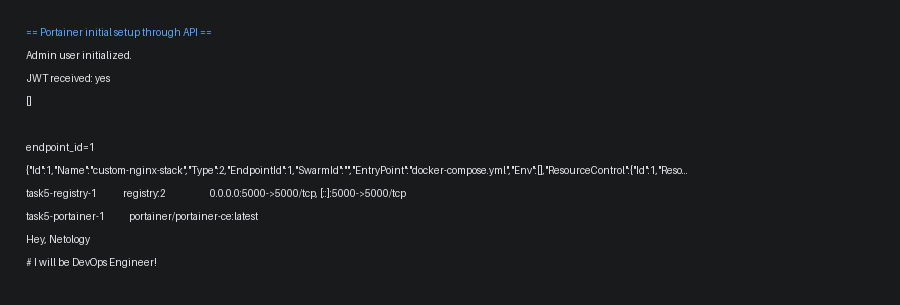
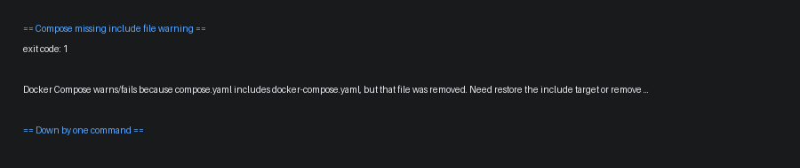

# Домашнее задание к занятию 4. Docker Compose

Работа выполнялась на VM в Yandex Cloud.

ОС: `Ubuntu 24.04.4 LTS`  
Docker: `29.6.0`  
Docker Compose: `v5.1.4`

## Задача 1

Создал `Dockerfile` на базе `nginx:1.29.0` и заменил стандартную страницу на свой `index.html`.

Содержимое страницы:

```text
Hey, Netology
# I will be DevOps Engineer!
```

Сборка:

```bash
docker build -t custom-nginx:1.0.0 .
```

DockerHub не использовал, потому что на учебной VM не настраивал учетку DockerHub. Образ собран и дальше используется локально.



## Задача 2

Запустил контейнер из образа `custom-nginx:1.0.0`:

```bash
docker run -d --name azmail-custom-nginx-t2 -p 127.0.0.1:8080:80 custom-nginx:1.0.0
docker rename azmail-custom-nginx-t2 custom-nginx-t2
```

Проверил `docker ps`, слушающий порт `127.0.0.1:8080`, логи, содержимое `index.html` через `base64` и ответ через `curl`.



## Задача 3

Подключился к контейнеру через `docker attach` и отправил `Ctrl-C`. Контейнер остановился, потому что `attach` подключается к основному процессу контейнера. В этом случае `Ctrl-C` отправил `SIGINT` nginx-процессу, а после завершения PID 1 Docker остановил контейнер.

После этого контейнер был перезапущен. Внутри контейнера установил `nano` и `curl`, затем поменял порт nginx с `80` на `81` и сделал reload.

Проверка внутри контейнера:

- `curl http://127.0.0.1:80` не отвечает;
- `curl http://127.0.0.1:81` отвечает.

Проверка с хоста:

- `docker port custom-nginx-t2` все еще показывает проброс `127.0.0.1:8080 -> 80/tcp`;
- `curl http://127.0.0.1:8080` не работает.

Проблема в том, что Docker пробрасывает порт хоста на порт `80` внутри контейнера, а nginx внутри уже слушает `81`. Настройка nginx изменилась, а проброс портов Docker нет.

Контейнер удален командой:

```bash
docker rm -f custom-nginx-t2
```



## Задача 4

Запустил два контейнера с общей volume-директорией:

- `quay.io/centos/centos:stream9`;
- `debian:12`.

Текущий каталог хоста был подключен в `/data` обоих контейнеров.

В CentOS-контейнере создал файл `from-centos.txt`, на хосте создал `from-host.txt`. Потом из Debian-контейнера посмотрел список файлов и вывел их содержимое.

Оба файла видны во втором контейнере, потому что `/data` у обоих контейнеров указывает на один и тот же каталог хоста.



## Задача 5

Создал каталог `task5` с двумя файлами:

- `compose.yaml`;
- `docker-compose.yaml`.

При запуске:

```bash
docker compose up -d
```

Docker Compose выбрал `compose.yaml`. В выводе было предупреждение, что найдено несколько файлов, но используется именно `compose.yaml`.

Потом изменил `compose.yaml` и подключил второй файл через `include`, чтобы запустились оба сервиса:

```yaml
include:
  - docker-compose.yaml
```

После этого поднялись:

- `portainer/portainer-ce:latest`;
- `registry:2`.

Образ `custom-nginx:1.0.0` загрузил в локальный registry:

```bash
docker tag custom-nginx:1.0.0 127.0.0.1:5000/custom-nginx:latest
docker push 127.0.0.1:5000/custom-nginx:latest
```

Проверка registry:

```json
{"repositories":["custom-nginx"]}
```



Portainer был настроен, через него создан stack с nginx из локального registry:

```yaml
version: '3'
services:
  nginx:
    image: 127.0.0.1:5000/custom-nginx
    ports:
      - "9090:80"
```

Контейнер запустился, `curl http://127.0.0.1:9090` вернул страницу `Hey, Netology`.



После удаления `docker-compose.yaml` команда `docker compose up -d` завершилась ошибкой:

```text
open /tmp/netology-docker-intro/task5/docker-compose.yaml: no such file or directory
```

Причина простая: в `compose.yaml` остался `include` на удаленный файл. Нужно вернуть файл или убрать include.

Compose-проект погашен одной командой:

```bash
docker compose down --remove-orphans
```



## Файлы

Файлы, которые использовались в работе, лежат в каталоге `work/`. Полные выводы команд лежат в `evidence/`.
