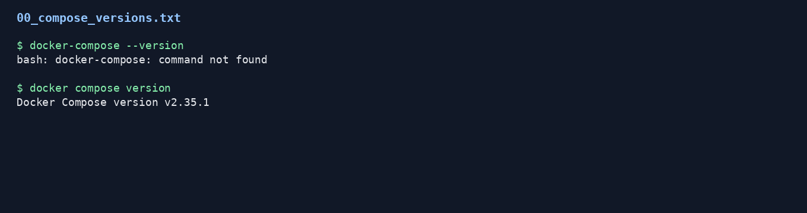
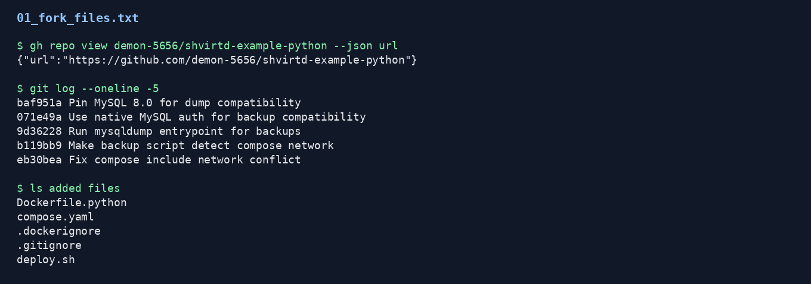
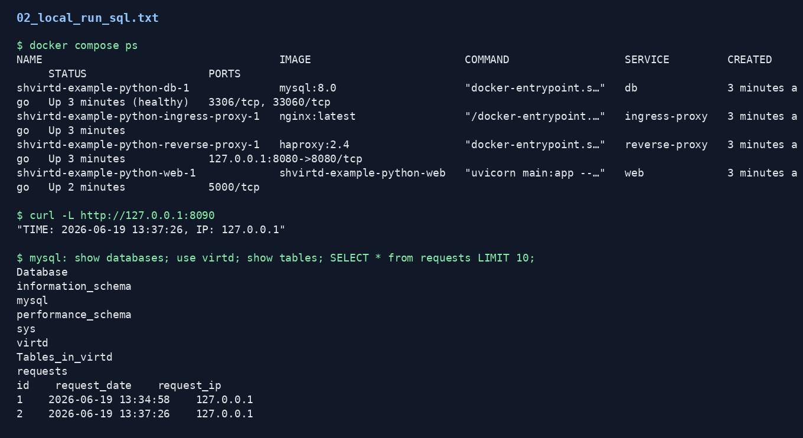
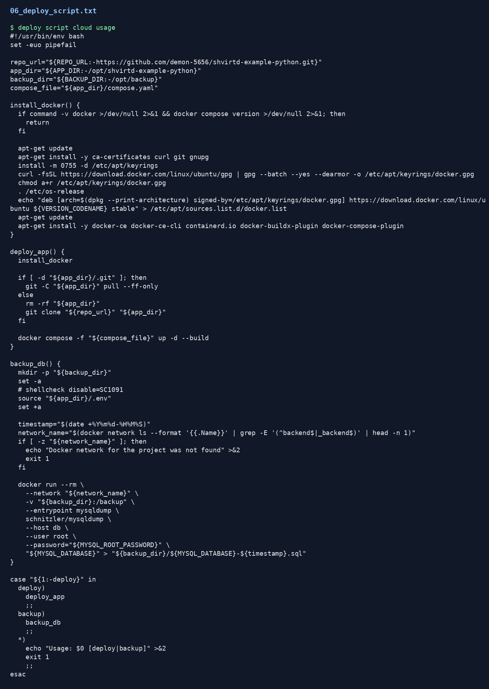
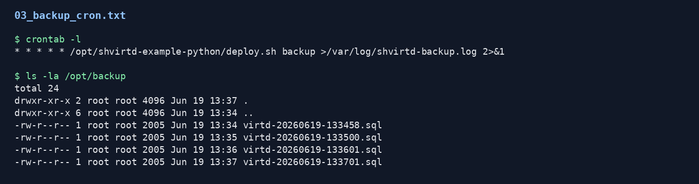
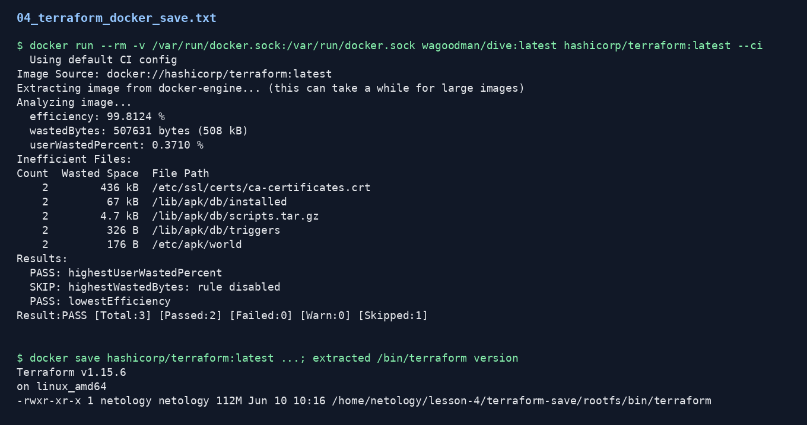
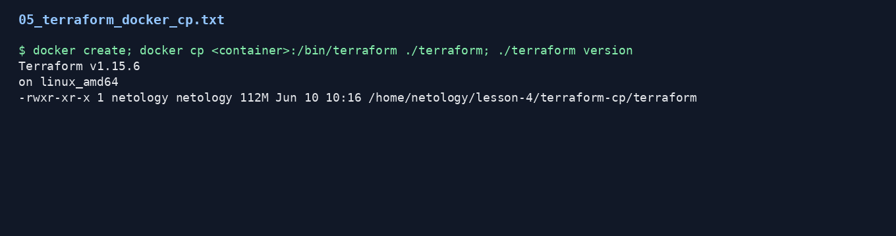

# Домашнее задание к занятию 5. Практическое применение Docker

Fork проекта: https://github.com/demon-5656/shvirtd-example-python

## Задача 0

Проверена учебная среда:

- `docker-compose` отсутствует;
- `docker compose` установлен, версия выше требуемой `v2.24.x`.



## Задача 1

В fork добавлены пять файлов:

- `Dockerfile.python`;
- `compose.yaml`;
- `.dockerignore`;
- `.gitignore`;
- `deploy.sh`.

`Dockerfile.python` сделан на базе `python:3.12-slim`, использует multistage-сборку, содержит `COPY . .` и запускает приложение через:

```bash
uvicorn main:app --host 0.0.0.0 --port 5000
```



## Задача 3

Проект запущен локально через Docker Compose. `compose.yaml` подключает `proxy.yaml` через `include`, поднимает сервисы `web` и `db`, использует `.env` для переменных MySQL и фиксированные адреса в сети `backend`.

Проверка HTTP:

```bash
curl -L http://127.0.0.1:8090
```

Ответ содержит время и IP-адрес.

Также выполнен SQL-запрос:

```sql
show databases;
use virtd;
show tables;
SELECT * from requests LIMIT 10;
```



## Задача 4

Для запуска на удаленной VM подготовлен `deploy.sh`. Скрипт:

- устанавливает Docker при необходимости;
- клонирует fork в `/opt/shvirtd-example-python`;
- запускает проект командой `docker compose up -d --build`.

Скрипт проверен в учебной Linux VM. Для запуска на Yandex Cloud VM достаточно выполнить:

```bash
sudo apt-get update
sudo apt-get install -y git
sudo git clone https://github.com/demon-5656/shvirtd-example-python.git /opt/shvirtd-example-python
sudo /opt/shvirtd-example-python/deploy.sh
```

После запуска внешний URL должен проверяться по порту `8090`.



## Задача 5

В `deploy.sh` добавлен режим резервного копирования:

```bash
sudo /opt/shvirtd-example-python/deploy.sh backup
```

Backup выполняется контейнером `schnitzler/mysqldump`. Пароли не указаны в коде явно, значения берутся из `.env`.

Cron настроен на запуск backup раз в минуту:

```cron
* * * * * /opt/shvirtd-example-python/deploy.sh backup >/var/log/shvirtd-backup.log 2>&1
```

В `/opt/backup` создано несколько SQL-дампов.



## Задача 6

Скачан образ `hashicorp/terraform:latest`. Образ просмотрен через `dive`, затем сохранен через `docker save`. Из сохраненного архива извлечен файл `/bin/terraform`, после чего проверен запуск бинарного файла.



## Задача 6.1

Аналогичный результат получен через `docker cp`: создан временный контейнер из `hashicorp/terraform:latest`, файл `/bin/terraform` скопирован на машину и проверен запуск.



## Файлы подтверждения

Полные выводы команд находятся в каталоге `evidence/`.
