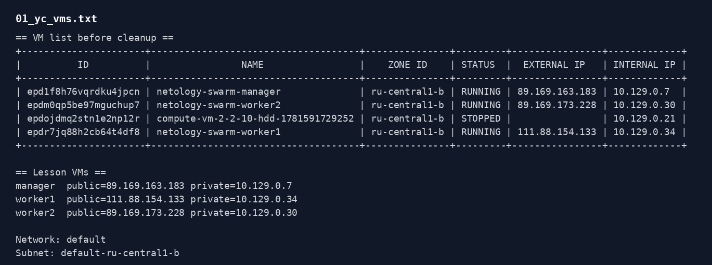
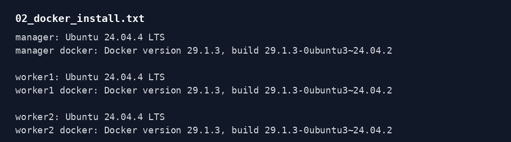
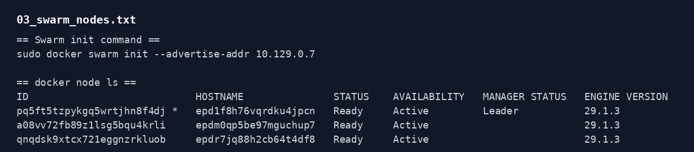
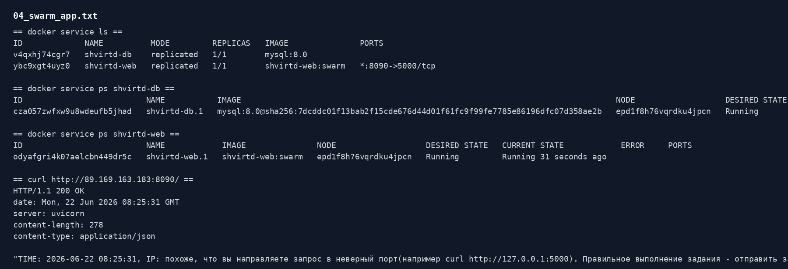
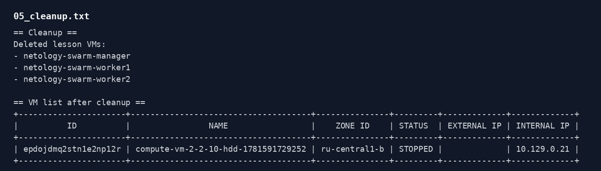

# Домашнее задание к занятию 6. Docker Swarm

Источник задания: https://github.com/netology-code/virtd-homeworks/tree/shvirtd-1/05-virt-05-docker-swarm

Работа выполнялась в Yandex Cloud. После проверки стенд удален, чтобы не тратить деньги.

## Задача 1

В Yandex Cloud созданы три прерываемые VM в одной сети `default` и подсети `default-ru-central1-b`.

| Роль | Имя VM | Private IP | Public IP |
| --- | --- | --- | --- |
| manager | `netology-swarm-manager` | `10.129.0.7` | `89.169.163.183` |
| worker | `netology-swarm-worker1` | `10.129.0.34` | `111.88.154.133` |
| worker | `netology-swarm-worker2` | `10.129.0.30` | `89.169.173.228` |

На всех VM установлены:

- ОС: `Ubuntu 24.04.4 LTS`;
- Docker: `29.1.3`.

Swarm инициализирован на manager-ноде по приватному адресу:

```bash
sudo docker swarm init --advertise-addr 10.129.0.7
```

Две worker-ноды подключены к кластеру через `docker swarm join`.

Проверка кластера:

```text
ID                            HOSTNAME               STATUS    AVAILABILITY   MANAGER STATUS   ENGINE VERSION
pq5ft5tzpykgq5wrtjhn8f4dj *   epd1f8h76vqrdku4jpcn   Ready     Active         Leader           29.1.3
a08vv72fb89z1lsg5bqu4krli     epdm0qp5be97mguchup7   Ready     Active                          29.1.3
qnqdsk9xtcx721eggnzrkluob     epdr7jq88h2cb64t4df8   Ready     Active                          29.1.3
```





## Задача 2

Дополнительно проверил запуск приложения из fork предыдущего задания:

https://github.com/demon-5656/shvirtd-example-python

Исходный compose-файл из предыдущей работы напрямую в Swarm не переносил, потому что `docker stack deploy` не собирает image через `build`, а еще там были настройки, которые удобнее для обычного Compose: `include`, фиксированные IP и `depends_on` с healthcheck.

Поэтому для проверки Swarm сделал так:

```bash
sudo docker build -t shvirtd-web:swarm -f Dockerfile.python .
sudo docker network create --driver overlay shvirtd-net
sudo docker service create --name shvirtd-db --network shvirtd-net mysql:8.0
sudo docker service create --name shvirtd-web \
  --network shvirtd-net \
  --constraint node.role==manager \
  --publish published=8090,target=5000 \
  shvirtd-web:swarm
```

`shvirtd-web` ограничен manager-нодой, потому что образ был собран локально на manager и не отправлялся в registry. Для нормального production-варианта образ нужно загрузить в DockerHub, GHCR или свой registry, чтобы любая worker-нода могла его скачать.

Проверка сервисов:

```text
ID             NAME          MODE         REPLICAS   IMAGE               PORTS
v4qxhj74cgr7   shvirtd-db    replicated   1/1        mysql:8.0
ybc9xgt4uyz0   shvirtd-web   replicated   1/1        shvirtd-web:swarm   *:8090->5000/tcp
```

HTTP-проверка:

```bash
curl -i http://89.169.163.183:8090/
```

Ответ был `HTTP/1.1 200 OK`. Приложение вернуло свой штатный текст с временем запроса.



## Задача 3

Terraform/Ansible-часть пока не выполнялась. По курсу это логичнее доделывать после отдельного блока по IaC, чтобы не писать автоматизацию вслепую.

## Удаление стенда

После проверки три VM `netology-swarm-*` удалены. В облаке осталась только старая остановленная VM, не относящаяся к этому заданию.



## Файлы подтверждения

Полные выводы команд находятся в каталоге `evidence/`.
