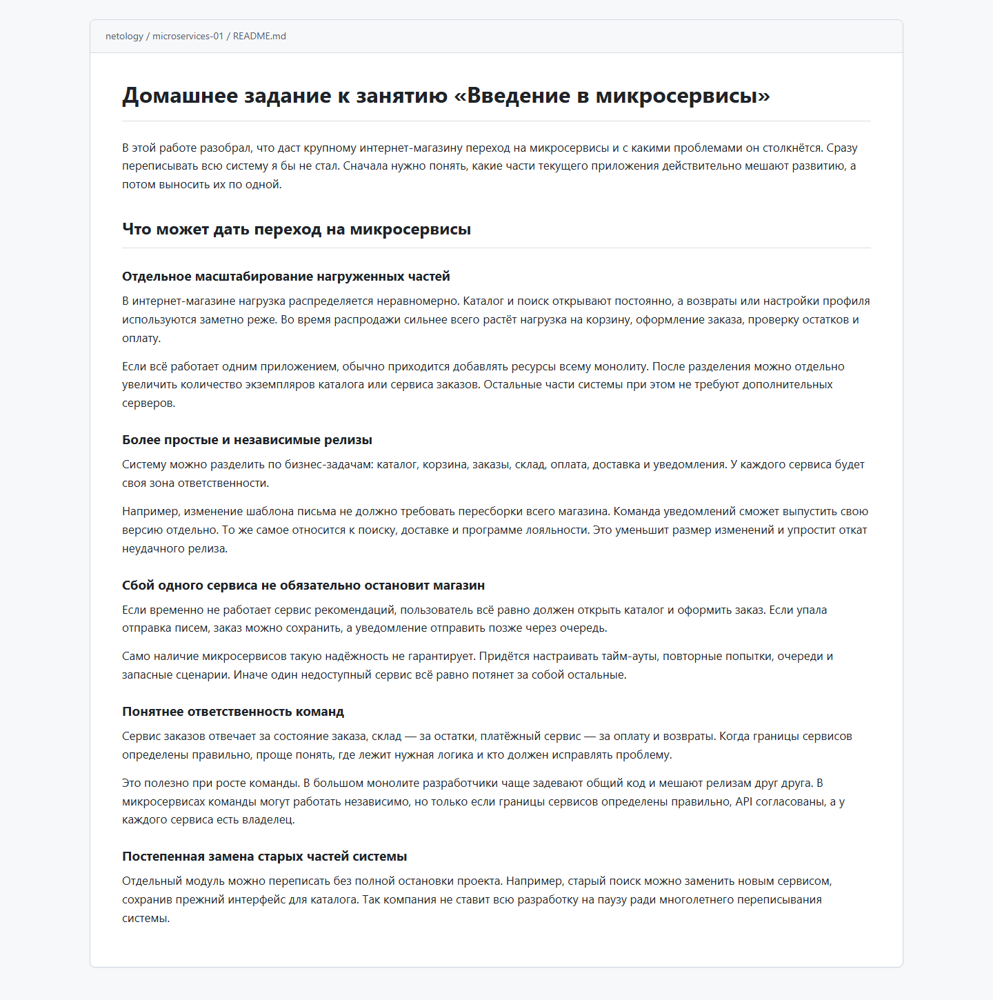
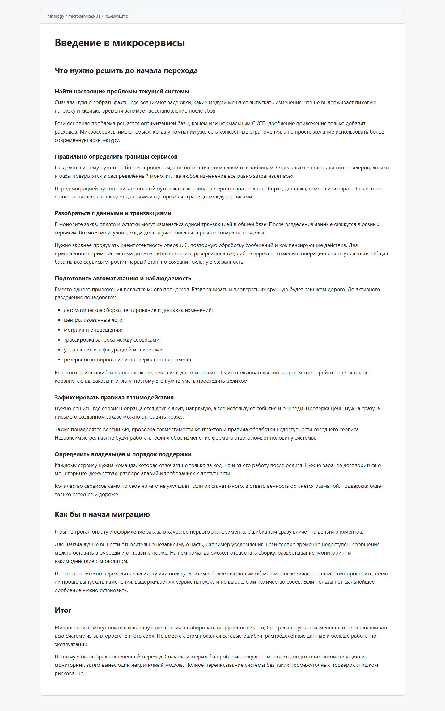

# Домашнее задание к занятию «Введение в микросервисы»

В этой работе разобрал, что даст крупному интернет-магазину переход на микросервисы и с какими проблемами он столкнётся. Сразу переписывать всю систему я бы не стал. Сначала нужно понять, какие части текущего приложения действительно мешают развитию, а потом выносить их по одной.

## Что может дать переход на микросервисы

### Отдельное масштабирование нагруженных частей

В интернет-магазине нагрузка распределяется неравномерно. Каталог и поиск открывают постоянно, а возвраты или настройки профиля используются заметно реже. Во время распродажи сильнее всего растёт нагрузка на корзину, оформление заказа, проверку остатков и оплату.

Если всё работает одним приложением, обычно приходится добавлять ресурсы всему монолиту. После разделения можно отдельно увеличить количество экземпляров каталога или сервиса заказов. Остальные части системы при этом не требуют дополнительных серверов.

### Более простые и независимые релизы

Систему можно разделить по бизнес-задачам: каталог, корзина, заказы, склад, оплата, доставка и уведомления. У каждого сервиса будет своя зона ответственности.

Например, изменение шаблона письма не должно требовать пересборки всего магазина. Команда уведомлений сможет выпустить свою версию отдельно. То же самое относится к поиску, доставке и программе лояльности. Это уменьшит размер изменений и упростит откат неудачного релиза.

### Сбой одного сервиса не обязательно остановит магазин

Если временно не работает сервис рекомендаций, пользователь всё равно должен открыть каталог и оформить заказ. Если упала отправка писем, заказ можно сохранить, а уведомление отправить позже через очередь.

Само наличие микросервисов такую надёжность не гарантирует. Придётся настраивать тайм-ауты, повторные попытки, очереди и запасные сценарии. Иначе один недоступный сервис всё равно потянет за собой остальные.

### Понятнее ответственность команд

Сервис заказов отвечает за состояние заказа, склад — за остатки, платёжный сервис — за оплату и возвраты. Когда границы сервисов определены правильно, проще понять, где лежит нужная логика и кто должен исправлять проблему.

Это полезно при росте команды. В большом монолите разработчики чаще задевают общий код и мешают релизам друг друга. В микросервисах команды могут работать независимо, но только если границы сервисов определены правильно, API согласованы, а у каждого сервиса есть владелец.

### Постепенная замена старых частей системы

Отдельный модуль можно переписать без полной остановки проекта. Например, старый поиск можно заменить новым сервисом, сохранив прежний интерфейс для каталога. Так компания не ставит всю разработку на паузу ради многолетнего переписывания системы.

## Что нужно решить до начала перехода

### Найти настоящие проблемы текущей системы

Сначала нужно собрать факты: где возникают задержки, какие модули мешают выпускать изменения, что не выдерживает пиковую нагрузку и сколько времени занимает восстановление после сбоя.

Если основная проблема решается оптимизацией базы, кэшем или нормальным CI/CD, дробление приложения только добавит расходов. Микросервисы имеют смысл, когда у компании уже есть конкретные ограничения, а не просто желание использовать более современную архитектуру.

### Правильно определить границы сервисов

Разделять систему нужно по бизнес-процессам, а не по техническим слоям или таблицам. Отдельные сервисы для контроллеров, логики и базы превратятся в распределённый монолит, где любое изменение всё равно затрагивает всех.

Перед миграцией нужно описать полный путь заказа: корзина, резерв товара, оплата, сборка, доставка, отмена и возврат. После этого станет понятнее, кто владеет данными и где проходят границы между сервисами.

### Разобраться с данными и транзакциями

В монолите заказ, оплата и остатки могут изменяться одной транзакцией в общей базе. После разделения данные окажутся в разных сервисах. Возможна ситуация, когда деньги уже списаны, а резерв товара не создался.

Нужно заранее продумать идемпотентность операций, повторную обработку сообщений и компенсирующие действия. Для приведённого примера система должна либо повторить резервирование, либо корректно отменить операцию и вернуть деньги. Общая база на все сервисы упростит первый этап, но сохранит сильную связанность.

### Подготовить автоматизацию и наблюдаемость

Вместо одного приложения появится много процессов. Разворачивать и проверять их вручную будет слишком дорого. До активного разделения понадобятся:

- автоматическая сборка, тестирование и доставка изменений;
- централизованные логи;
- метрики и оповещения;
- трассировка запроса между сервисами;
- управление конфигурацией и секретами;
- резервное копирование и проверка восстановления.

Без этого поиск ошибки станет сложнее, чем в исходном монолите. Один пользовательский запрос может пройти через каталог, корзину, склад, заказы и оплату, поэтому его нужно уметь проследить целиком.

### Зафиксировать правила взаимодействия

Нужно решить, где сервисы обращаются друг к другу напрямую, а где используют события и очереди. Проверка цены нужна сразу, а письмо о созданном заказе можно отправить позже.

Также понадобятся версии API, проверка совместимости контрактов и правила обработки недоступности соседнего сервиса. Независимые релизы не будут работать, если любое изменение формата ответа ломает половину системы.

### Определить владельцев и порядок поддержки

Каждому сервису нужна команда, которая отвечает не только за код, но и за его работу после релиза. Нужно заранее договориться о мониторинге, дежурствах, разборе аварий и требованиях к доступности.

Количество сервисов само по себе ничего не улучшает. Если их станет много, а ответственность останется размытой, поддержка будет только сложнее и дороже.

## Как бы я начал миграцию

Я бы не трогал оплату и оформление заказа в качестве первого эксперимента. Ошибка там сразу влияет на деньги и клиентов.

Для начала лучше вынести относительно независимую часть, например уведомления. Если сервис временно недоступен, сообщения можно оставить в очереди и отправить позже. На нём команда сможет отработать сборку, развёртывание, мониторинг и взаимодействие с монолитом.

После этого можно переходить к каталогу или поиску, а затем к более связанным областям. После каждого этапа стоит проверить, стало ли проще выпускать изменения, выдерживает ли сервис нагрузку и не выросло ли количество сбоев. Если пользы нет, дальнейшее дробление нужно остановить.

## Итог

Микросервисы могут помочь магазину отдельно масштабировать нагруженные части, быстрее выпускать изменения и не останавливать всю систему из-за второстепенного сбоя. Но вместе с этим появятся сетевые ошибки, распределённые данные и больше работы по эксплуатации.

Поэтому я бы выбрал постепенный переход. Сначала измерил бы проблемы текущего монолита, подготовил автоматизацию и мониторинг, затем вынес один некритичный модуль. Полное переписывание системы без таких промежуточных проверок слишком рискованно.

## Скриншоты

