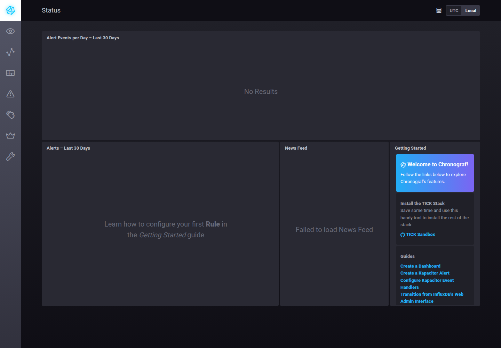
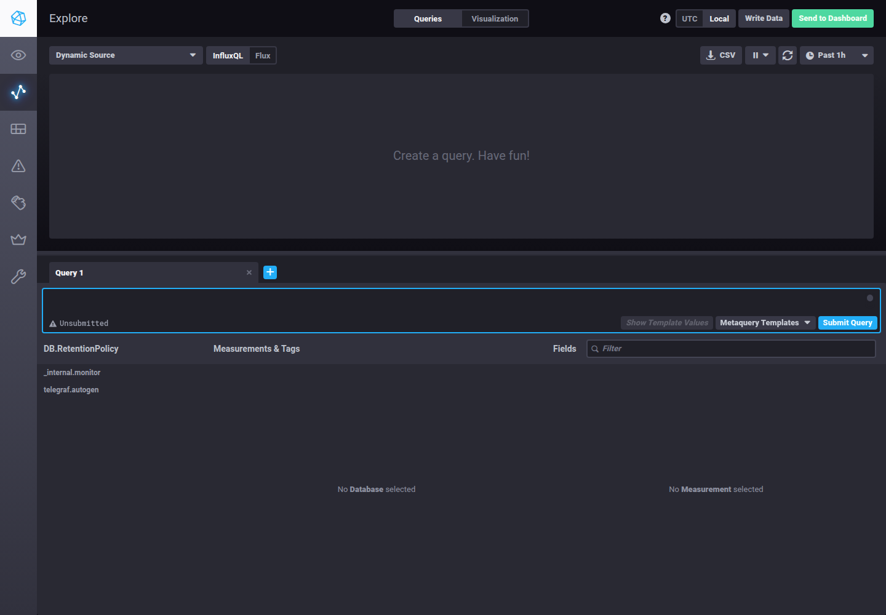

# Домашнее задание к занятию 13 «Системы мониторинга»

В этой работе разобрал основные подходы к мониторингу и поднял локальный TICK-стек. Заодно добавил сбор метрик Docker, чтобы в InfluxDB были видны не только системные показатели, но и состояние контейнеров.

## Ссылки

Репозиторий с работой:

- [`monitoring-02`](.) — исходники TICK-стека, конфигурация и доказательства;
- [`docker-compose.yml`](docker-compose.yml) — запуск сервисов;
- [`telegraf/telegraf.conf`](telegraf/telegraf.conf) — конфигурация Telegraf.

Для отправки в ЛК:

```text
https://github.com/demon-5656/Tasks/blob/main/netology/monitoring-02/README.md
```

## 1. Минимальный набор метрик

Для такой платформы вывел бы следующий минимум:

- **HTTP-доступность и время ответа** — показывает, работает ли сервис снаружи и насколько быстро он отвечает;
- **HTTP-коды ответов и доля ошибок** — позволяет отделить успешные запросы от 4xx/5xx;
- **CPU utilization и load average** — вычисления нагружают процессор, поэтому важно видеть текущую загрузку и наличие очереди на выполнение;
- **RAM и swap** — нехватка памяти может привести к замедлению расчётов и обращению к swap;
- **свободное место на диске и inodes** — текстовые отчёты сохраняются на диск, поэтому нужно контролировать и объём, и возможность создавать новые файлы;
- **количество и размер сохранённых отчётов** — это уже прикладная метрика, которая показывает, не остановилось ли сохранение результатов.

Такой набор закрывает доступность, качество HTTP, ресурсы вычислений и место для результатов работы.

## 2. Как объяснить метрики менеджеру

Технические показатели можно связать с понятными для бизнеса SLI, SLO и SLA.

- **SLI** — фактически измеряемый показатель: например, доля успешных HTTP-запросов или p95 времени ответа.
- **SLO** — целевой уровень: например, 99% успешных ответов и p95 не больше 2 секунд.
- **SLA** — договорённость с клиентом и последствия её нарушения.

Менеджеру показал бы не `CPUla` и `inodes`, а дашборд с ответами на вопросы: доступен ли сервис, сколько запросов обработано, сколько завершилось ошибкой, каково время ответа и выполняется ли целевой уровень качества.

## 3. Ошибки приложений без системы логов

Если полноценный сбор логов пока не финансируется, можно подключить Sentry или аналогичный error-tracking сервис. Приложение отправляет туда только события ошибок и stack trace, а разработчики получают уведомления и группировку одинаковых проблем.

В событие стоит добавлять окружение (`stage`/`production`), hostname, версию приложения и идентификатор реплики. Это не заменяет централизованные логи, но закрывает основную потребность разработчиков — видеть ошибки в реальном времени.

## 4. Ошибка в расчёте SLA

В формуле пропущены успешные ответы **3xx**:

```text
SLI = (количество 2xx + количество 3xx) / количество всех запросов
```

Если в системе нет 4xx и 5xx, но есть перенаправления 3xx, то текущая формула считает их неуспешными. Поэтому показатель застрял около 70%. Нужно включить 3xx в числитель либо явно договориться, что редиректы считаются отдельным классом.

## 5. Pull и push

### Pull

Система мониторинга сама периодически забирает метрики у агентов или exporter-ов.

Плюсы:

- единая настройка интервалов и контроль процесса сбора;
- проще понять, какие targets доступны;
- удобно обнаруживать недоступные endpoints;
- меньше логики на стороне агента.

Минусы:

- система мониторинга должна иметь сетевой доступ к каждому target;
- сложнее собирать метрики с машин за NAT и из закрытых сетей;
- при большом количестве targets растёт нагрузка на сборщик.

### Push

Агент сам отправляет метрики в систему мониторинга или промежуточный шлюз.

Плюсы:

- подходит для закрытых сетей и динамических хостов;
- агент может буферизовать и отправлять данные при восстановлении связи;
- проще реплицировать поток метрик в несколько систем.

Минусы:

- сложнее контролировать, кто и куда отправляет данные;
- потеря агента может остаться незаметной без отдельного heartbeat;
- нужно аккуратно настраивать очереди, повторные отправки и защиту endpoint-а.

## 6. Модели систем мониторинга

| Система | Модель | Комментарий |
| --- | --- | --- |
| Prometheus | Pull | Обычно забирает метрики с exporter-ов; для отдельных сценариев есть Pushgateway. |
| TICK | Гибридная | Telegraf может собирать данные pull-плагинами и отправлять их push-моделью в InfluxDB. |
| Zabbix | Гибридная | Поддерживает активные проверки агентом и пассивные проверки, когда сервер сам обращается к агенту. |
| VictoriaMetrics | Гибридная | Поддерживает pull через vmagent и push-совместимые протоколы, включая remote write. |
| Nagios | Преимущественно pull | Сервер выполняет проверки сам, но возможны passive checks и отправка результатов агентами. |

## 7. Запуск TICK-стека

Склонировал sandbox InfluxData и запустил стек через Docker Compose. В актуальном окружении пришлось обновить несколько устаревших мест исходного примера:

- зафиксировал `TYPE=latest`;
- явно использовал InfluxDB 1.8, потому что конфигурация задания рассчитана на InfluxQL и базу `telegraf.autogen`;
- добавил права Telegraf на чтение Docker socket;
- убрал устаревшие параметры Docker input, которые новая версия Telegraf больше не принимает;
- поправил права каталогов данных Chronograf и Kapacitor.

Проверка контейнеров:

```text
chronograf       Up
influxdb         Up
kapacitor        Up
telegraf         Up
```

В исходном sandbox также работал вспомогательный сервис документации; в конфигурацию для сдачи он не включён.

Исходный вывод проверки сохранён в [`evidence/docker-compose-ps.txt`](evidence/docker-compose-ps.txt).

Chronograf доступен на `http://localhost:8888`.



## 8. Data Explorer и CPU

В интерфейсе Chronograf отображается база `telegraf.autogen` и список измерений, включая `cpu` и Docker-измерения:



Для проверки выбранного ряда выполнил запрос через InfluxDB API:

```sql
SELECT mean("usage_system") AS usage_system
FROM "cpu"
WHERE "host" = 'telegraf-getting-started'
  AND time > now() - 10m
GROUP BY time(1m)
```

В ответе есть значения загрузки CPU, например `0.275`, `0.526`, `0.671` и `0.630`. Полный JSON-ответ: [`evidence/cpu-query.json`](evidence/cpu-query.json).

## 9. Метрики Docker

В `telegraf/telegraf.conf` добавлен input Docker:

```toml
[[inputs.docker]]
  endpoint = "unix:///var/run/docker.sock"
```

После перезапуска Telegraf в базе появились измерения Docker:

```text
docker
docker_container_blkio
docker_container_cpu
docker_container_health
docker_container_mem
docker_container_net
docker_container_status
```

Полный список измерений: [`evidence/measurements.json`](evidence/measurements.json).

Дополнительно проверено, что контейнер Telegraf остаётся запущенным и продолжает отправлять метрики. Лог: [`evidence/telegraf.log`](evidence/telegraf.log).

## Итог

Основная часть задания выполнена. TICK-стек работает локально, Chronograf открывается, InfluxDB получает системные и Docker-метрики, а запрос к `cpu.usage_system` возвращает данные для построения графика.
