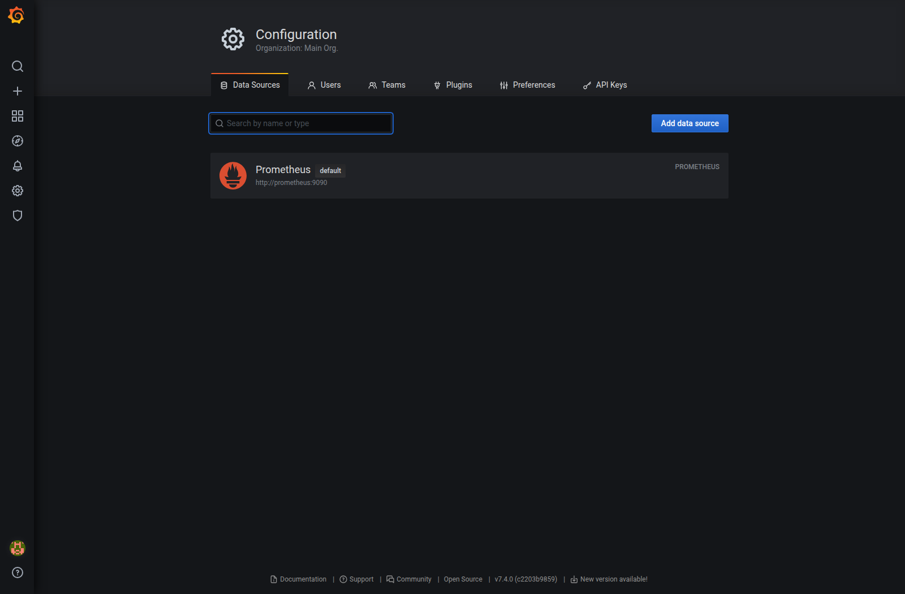
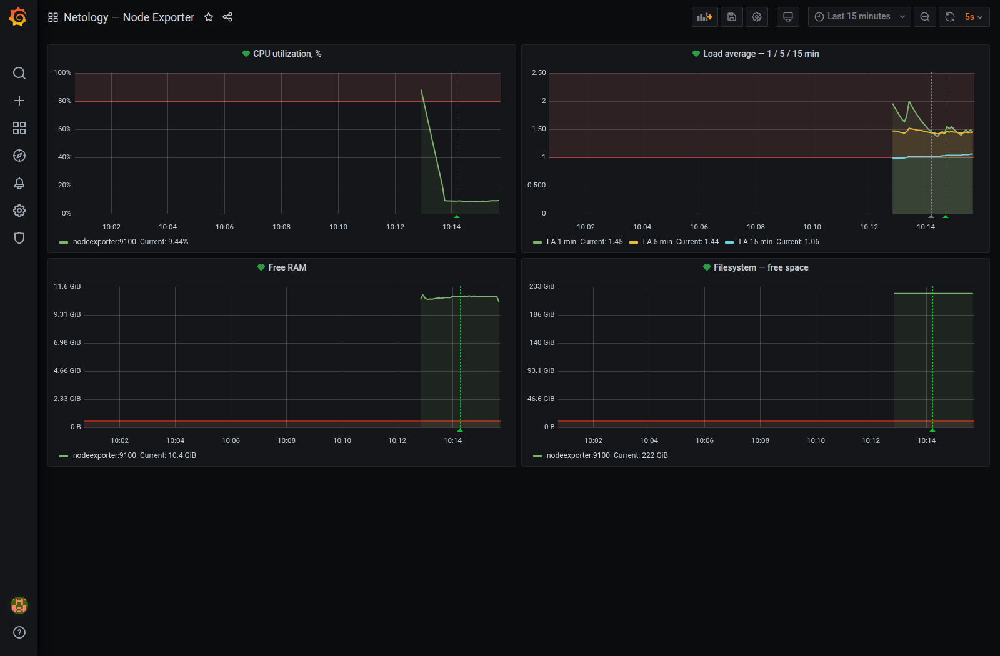
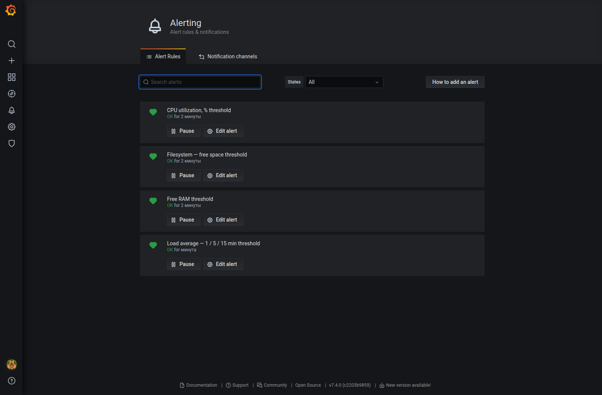

# Домашнее задание к занятию 14 «Средство визуализации Grafana»

## Задание 1. Подключение Prometheus

За основу взял [docker-compose из help](https://github.com/netology-code/mnt-homeworks/tree/MNT-video/10-monitoring-03-grafana/help). Поднял три сервиса: Grafana 7.4.0, Prometheus 2.24.1 и node-exporter 1.0.1. Версии оставил как в учебном примере, чтобы использовать предусмотренные в нём алерты Grafana.

Grafana и Prometheus доступны только через localhost: это учебный стенд со старыми версиями, в открытый интернет его не выставлял. Данные Grafana и Prometheus хранятся в Docker volumes. Источник данных и дашборд добавлены в provisioning, поэтому конфигурация восстанавливается при новом запуске.

```bash
docker compose up -d
docker compose ps
```

В Grafana подключён источник `Prometheus` с адресом `http://prometheus:9090`, режим доступа — Server (proxy). Источник выбран по умолчанию. Prometheus опрашивает `nodeexporter:9100` каждые 5 секунд; target имеет состояние `UP`.



## Задание 2. Дашборд

Создал дашборд **Netology — Node Exporter** с четырьмя панелями. Период отображения — последние 15 минут, обновление — каждые 5 секунд.

### Утилизация CPU

```promql
100 - avg by (instance) (
  rate(node_cpu_seconds_total{job="nodeexporter",mode="idle"}[1m])
) * 100
```

`rate` рассчитывает долю времени простоя каждого ядра, `avg` усредняет её по хосту. Вычитаю idle из 100 — получается загрузка CPU в процентах.

### CPULA 1/5/15

```promql
node_load1{job="nodeexporter"}
node_load5{job="nodeexporter"}
node_load15{job="nodeexporter"}
```

Три линии показывают load average за 1, 5 и 15 минут. Это не проценты загрузки процессора: показатель учитывает задачи, готовые к выполнению, и задачи в непрерываемом ожидании.

### Свободная оперативная память

```promql
node_memory_MemFree_bytes{job="nodeexporter"}
```

Здесь вывел именно свободную RAM, как указано в задании. `MemAvailable` — другой показатель: он оценивает доступную приложениям память с учётом освобождаемого кеша. Единицы на панели — GiB.

### Свободное место на файловой системе

```promql
node_filesystem_avail_bytes{
  job="nodeexporter",
  mountpoint="/",
  fstype!~"tmpfs|overlay|squashfs"
}
```

Панель показывает доступное обычному пользователю место на корневой файловой системе. Виртуальные файловые системы исключил, чтобы они не засоряли график.



## Задание 3. Алерты

Для каждой панели настроил отдельное правило. Условие проверяется каждые 10 секунд, используется среднее за последнюю минуту. Чтобы кратковременный скачок не приводил к тревоге, добавил выдержку `for: 1m`.

| Панель | Условие |
| --- | --- |
| CPU | Загрузка больше 80% |
| Load average | LA5 в расчёте на логический CPU больше 1 |
| RAM | Свободно меньше 512 MiB |
| Файловая система | Доступно меньше 10 GiB |

Для алерта по LA использовал отдельный запрос D, скрытый на графике:

```promql
node_load5{job="nodeexporter"}
/ on (instance)
count by (instance) (node_cpu_seconds_total{job="nodeexporter",mode="idle"})
```

`on (instance)` нужен для сопоставления рядов: после `count by` остаётся метка хоста, а у `node_load5` есть также `job`. На графике остаются исходные LA1/5/15; порог алерта 1 относится к нормализованному запросу D, а не к этим трём линиям.

При отсутствии данных правило переходит в `No Data`, при ошибке выполнения — в `Alerting`. Каналы Telegram/email не настраивал: это пункт задания повышенной сложности.

Проверил все четыре правила на реальных данных через Test rule: штатные условия вернули `OK`. Затем в тестовом запросе изменил порог, не сохраняя его в дашборд, — каждое правило вернуло `firing: true`. Это проверка вычисления условия, а не отправка уведомлений и не имитация аварии на хосте.



Краткий результат проверки: [verification.json](evidence/verification.json). Итоговый дашборд с зелёными индикаторами алертов показан в задании 2.

## Задание 4. JSON Model

Сохранил дашборд и выгрузил его полную модель через Grafana API в [dashboard.json](dashboard.json). Это модель сохранённого дашборда, включая запросы, расположение панелей и правила алертов, а не ответ API с обёрткой `meta`.

<details>
<summary>Полный листинг dashboard.json</summary>

```json
{
  "annotations": {
    "list": [
      {
        "builtIn": 1,
        "datasource": "-- Grafana --",
        "enable": true,
        "hide": true,
        "iconColor": "rgba(0, 211, 255, 1)",
        "name": "Annotations & Alerts",
        "type": "dashboard"
      }
    ]
  },
  "id": 1,
  "panels": [
    {
      "alert": {
        "conditions": [
          {
            "evaluator": {
              "params": [
                80
              ],
              "type": "gt"
            },
            "operator": {
              "type": "and"
            },
            "query": {
              "params": [
                "A",
                "1m",
                "now"
              ]
            },
            "reducer": {
              "params": [],
              "type": "avg"
            },
            "type": "query"
          }
        ],
        "executionErrorState": "alerting",
        "for": "1m",
        "frequency": "10s",
        "message": "Host resource threshold exceeded",
        "name": "CPU utilization, % threshold",
        "noDataState": "no_data",
        "notifications": []
      },
      "datasource": "Prometheus",
      "fill": 1,
      "gridPos": {
        "h": 9,
        "w": 12,
        "x": 0,
        "y": 0
      },
      "id": 1,
      "legend": {
        "current": true,
        "show": true,
        "values": true
      },
      "lines": true,
      "linewidth": 2,
      "targets": [
        {
          "expr": "100 - avg by (instance) (rate(node_cpu_seconds_total{job=\"nodeexporter\",mode=\"idle\"}[1m])) * 100",
          "legendFormat": "{{instance}}",
          "refId": "A"
        }
      ],
      "thresholds": [
        {
          "colorMode": "critical",
          "fill": false,
          "line": true,
          "op": "gt",
          "value": 80
        }
      ],
      "title": "CPU utilization, %",
      "tooltip": {
        "shared": true
      },
      "type": "graph",
      "xaxis": {
        "mode": "time",
        "show": true
      },
      "yaxes": [
        {
          "format": "percent",
          "min": 0,
          "show": true
        },
        {
          "format": "percent",
          "show": false
        }
      ]
    },
    {
      "alert": {
        "conditions": [
          {
            "evaluator": {
              "params": [
                1
              ],
              "type": "gt"
            },
            "operator": {
              "type": "and"
            },
            "query": {
              "params": [
                "D",
                "1m",
                "now"
              ]
            },
            "reducer": {
              "params": [],
              "type": "avg"
            },
            "type": "query"
          }
        ],
        "executionErrorState": "alerting",
        "for": "1m",
        "frequency": "10s",
        "message": "Host resource threshold exceeded",
        "name": "Load average — 1 / 5 / 15 min threshold",
        "noDataState": "no_data",
        "notifications": []
      },
      "datasource": "Prometheus",
      "fill": 1,
      "gridPos": {
        "h": 9,
        "w": 12,
        "x": 12,
        "y": 0
      },
      "id": 2,
      "legend": {
        "current": true,
        "show": true,
        "values": true
      },
      "lines": true,
      "linewidth": 2,
      "targets": [
        {
          "expr": "node_load1{job=\"nodeexporter\"}",
          "legendFormat": "LA 1 min",
          "refId": "A"
        },
        {
          "expr": "node_load5{job=\"nodeexporter\"}",
          "legendFormat": "LA 5 min",
          "refId": "B"
        },
        {
          "expr": "node_load15{job=\"nodeexporter\"}",
          "legendFormat": "LA 15 min",
          "refId": "C"
        },
        {
          "expr": "node_load5{job=\"nodeexporter\"} / on (instance) count by (instance) (node_cpu_seconds_total{job=\"nodeexporter\",mode=\"idle\"})",
          "hide": true,
          "legendFormat": "LA5 / CPU cores",
          "refId": "D"
        }
      ],
      "title": "Load average — 1 / 5 / 15 min",
      "tooltip": {
        "shared": true
      },
      "type": "graph",
      "xaxis": {
        "mode": "time",
        "show": true
      },
      "yaxes": [
        {
          "format": "short",
          "min": 0,
          "show": true
        },
        {
          "format": "short",
          "show": false
        }
      ]
    },
    {
      "alert": {
        "conditions": [
          {
            "evaluator": {
              "params": [
                536870912
              ],
              "type": "lt"
            },
            "operator": {
              "type": "and"
            },
            "query": {
              "params": [
                "A",
                "1m",
                "now"
              ]
            },
            "reducer": {
              "params": [],
              "type": "avg"
            },
            "type": "query"
          }
        ],
        "executionErrorState": "alerting",
        "for": "1m",
        "frequency": "10s",
        "message": "Host resource threshold exceeded",
        "name": "Free RAM threshold",
        "noDataState": "no_data",
        "notifications": []
      },
      "datasource": "Prometheus",
      "fill": 1,
      "gridPos": {
        "h": 9,
        "w": 12,
        "x": 0,
        "y": 9
      },
      "id": 3,
      "legend": {
        "current": true,
        "show": true,
        "values": true
      },
      "lines": true,
      "linewidth": 2,
      "targets": [
        {
          "expr": "node_memory_MemFree_bytes{job=\"nodeexporter\"}",
          "legendFormat": "{{instance}}",
          "refId": "A"
        }
      ],
      "thresholds": [
        {
          "colorMode": "critical",
          "fill": false,
          "line": true,
          "op": "lt",
          "value": 536870912
        }
      ],
      "title": "Free RAM",
      "tooltip": {
        "shared": true
      },
      "type": "graph",
      "xaxis": {
        "mode": "time",
        "show": true
      },
      "yaxes": [
        {
          "format": "bytes",
          "min": 0,
          "show": true
        },
        {
          "format": "bytes",
          "show": false
        }
      ]
    },
    {
      "alert": {
        "conditions": [
          {
            "evaluator": {
              "params": [
                10737418240
              ],
              "type": "lt"
            },
            "operator": {
              "type": "and"
            },
            "query": {
              "params": [
                "A",
                "1m",
                "now"
              ]
            },
            "reducer": {
              "params": [],
              "type": "avg"
            },
            "type": "query"
          }
        ],
        "executionErrorState": "alerting",
        "for": "1m",
        "frequency": "10s",
        "message": "Host resource threshold exceeded",
        "name": "Filesystem — free space threshold",
        "noDataState": "no_data",
        "notifications": []
      },
      "datasource": "Prometheus",
      "fill": 1,
      "gridPos": {
        "h": 9,
        "w": 12,
        "x": 12,
        "y": 9
      },
      "id": 4,
      "legend": {
        "current": true,
        "show": true,
        "values": true
      },
      "lines": true,
      "linewidth": 2,
      "targets": [
        {
          "expr": "node_filesystem_avail_bytes{job=\"nodeexporter\",mountpoint=\"/\",fstype!~\"tmpfs|overlay|squashfs\"}",
          "legendFormat": "{{instance}}",
          "refId": "A"
        }
      ],
      "thresholds": [
        {
          "colorMode": "critical",
          "fill": false,
          "line": true,
          "op": "lt",
          "value": 10737418240
        }
      ],
      "title": "Filesystem — free space",
      "tooltip": {
        "shared": true
      },
      "type": "graph",
      "xaxis": {
        "mode": "time",
        "show": true
      },
      "yaxes": [
        {
          "format": "bytes",
          "min": 0,
          "show": true
        },
        {
          "format": "bytes",
          "show": false
        }
      ]
    }
  ],
  "refresh": "5s",
  "schemaVersion": 27,
  "tags": [
    "netology"
  ],
  "time": {
    "from": "now-15m",
    "to": "now"
  },
  "timezone": "browser",
  "title": "Netology — Node Exporter",
  "uid": "netology-node",
  "version": 2
}
```

</details>

## Файлы работы

- [docker-compose.yml](docker-compose.yml) — учебный стек из help с локальными портами и provisioning;
- [prometheus.yml](prometheus/prometheus.yml) — сбор метрик node-exporter;
- [источник данных](grafana/provisioning/datasources/prometheus.yml);
- [провайдер дашборда](grafana/provisioning/dashboards/default.yml);
- [dashboard.json](dashboard.json) — экспорт дашборда с алертами.

Grafana: `http://localhost:3000`, учебный вход `admin / admin` из исходного help. Дашборд: `http://localhost:3000/d/netology-node/netology-node-exporter`.
