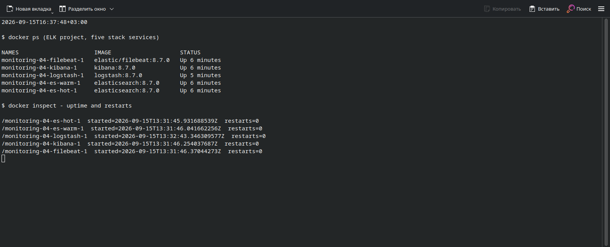
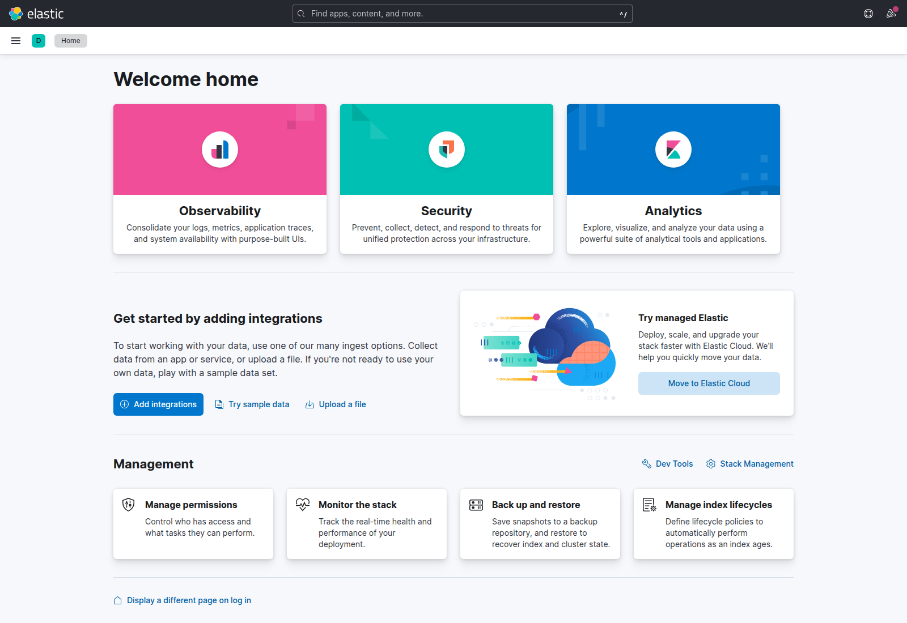
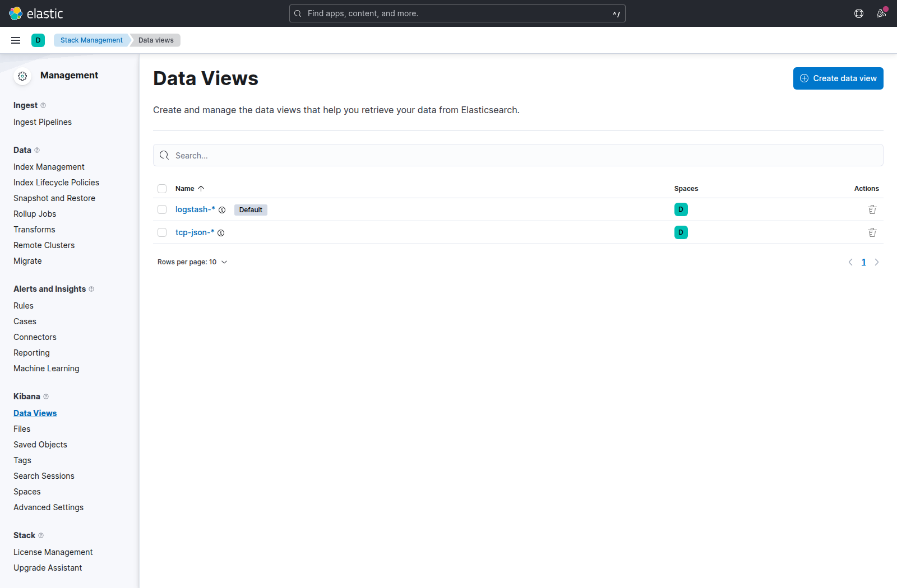
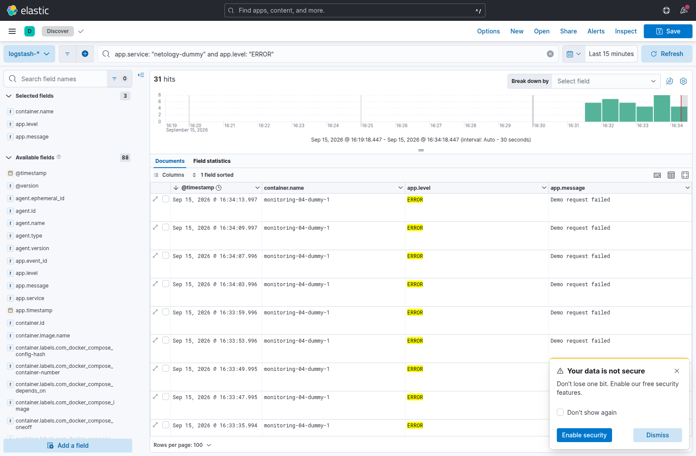

# Домашнее задание к занятию 15 «Система сбора логов Elastic Stack»

## Задание 1. Запуск стека

За основу взял [пример из help](https://github.com/netology-code/mnt-homeworks/tree/MNT-video/10-monitoring-04-elk/help). Поднял Elastic Stack версии 8.7.0:

- `es-hot` — роли `master`, `data_content`, `data_hot`;
- `es-warm` — роли `master`, `data_warm`;
- `logstash` — приём и обработка событий;
- `kibana` — просмотр и поиск логов;
- `filebeat` — чтение Docker-логов и отправка в Logstash.

Это пять контейнеров самого стека. Генератор `dummy` запускается отдельно через профиль `demo`: с ним контейнеров шесть, как и в исходном help. На скриншоте `docker ps` отфильтрованы именно пять сервисов ELK; другие контейнеры на машине в проверку не включены.

```bash
# Пять сервисов стека
docker compose up -d

# Стек и генератор событий
docker compose --profile demo up -d
```

Elasticsearch и Kibana опубликованы только на localhost. Авторизацию отключил, как в учебном примере; такой стенд нельзя выставлять в интернет. Значение `vm.max_map_count` на хосте уже было достаточным, менять его не понадобилось.

### Приём событий

Настроил два независимых входа Logstash:

```text
Docker stdout → Filebeat → Logstash Beats :5046 → logstash-* → Kibana
JSON по TCP              → Logstash TCP   :5044 → tcp-json-* → Kibana
```

В исходном help был только Beats input. Для обычных JSON-сообщений добавил `tcp` с кодеком `json_lines`: каждое событие завершается переводом строки.

```logstash
input {
  beats { port => 5046 }
  tcp {
    port => 5044
    codec => json_lines
    tags => ["tcp-json"]
  }
}
```

Filebeat автоматически обнаруживает Docker-контейнеры с меткой `course=netology-elk`. Собираются логи учебного стека и генератора, а не рабочих приложений на хосте. Сам Filebeat не помечен этой меткой, чтобы не отправлять собственные диагностические сообщения обратно в pipeline.

При первом запуске столкнулся с конфликтом типов: JSON разных приложений содержал одноимённые поля в разных форматах. Исправил фильтр — в `app.*` разбираются только события dummy, остальные Docker-логи сохраняются в `message`. После исправления новые ошибки индексации не появлялись.

Для учебных индексов задан один primary shard и ноль реплик, размещение — на `data_hot`. Это не отказоустойчивая конфигурация. Warm-нода подключена и имеет нужную роль, но автоматический перенос старых индексов через ILM в этой работе не настраивал.

### Проверка

Проверил конфигурацию Filebeat, подключение к Logstash и синтаксис pipeline:

```text
filebeat test config: Config OK
filebeat test output: talk to server... OK
logstash --config.test_and_exit: Configuration OK
Elasticsearch: green, 2 nodes, 0 unassigned shards
Kibana: All services are available
```

TCP-вход проверил отдельным событием:

```bash
python3 - <<'PY'
import json
import socket

with socket.create_connection(('127.0.0.1', 5044)) as sock:
    event = {
        'message': 'TCP JSON input verified',
        'test_id': 'netology-tcp-check',
        'level': 'INFO'
    }
    sock.sendall((json.dumps(event) + '\n').encode())
PY
```

Событие найдено в индексе `tcp-json-*`. Отдельно проверил документ dummy в `logstash-*`: в нём присутствуют `agent.type: filebeat`, имя Docker-контейнера и разобранные поля `app.*`. Значит, проверен не только Elasticsearch, но и вся цепочка доставки Docker-логов.

Краткий ответ API и пример доставленного события: [verification.json](evidence/verification.json).

Скриншот состояния пяти сервисов после пяти минут непрерывной работы:



Исходный вывод команды: [docker-ps.txt](evidence/docker-ps.txt). Время проверки, uptime и число перезапусков: [uptime.json](evidence/uptime.json). Logstash один раз перезапускался после исправления фильтра; пятиминутный интервал отсчитан уже после этого перезапуска.

Рабочий интерфейс Kibana:



## Задание 2. Индексы и поиск логов

В Kibana 8.7 раздел Index Patterns называется **Data Views**. Создал два представления с временным полем `@timestamp`:

| Data View | Содержимое |
| --- | --- |
| `logstash-*` | Docker-логи, поступившие через Filebeat |
| `tcp-json-*` | JSON-события отдельного TCP-входа |

`logstash-*` выбран по умолчанию. Оба шаблона соответствуют реально существующим индексам с документами.



В Discover выбрал период «Last 15 minutes» и добавил столбцы `container.name`, `app.level`, `app.message`. Сначала проверил события приложения, затем отфильтровал ошибки:

```kql
app.service: "netology-dummy" and app.level: "ERROR"
```

На скриншоте видны время события, контейнер `monitoring-04-dummy-1`, уровень `ERROR` и сообщение `Demo request failed`. Это тестовые события, которые генератор действительно записал в stdout, а Filebeat доставил в Elasticsearch.



Гистограмма показывает распределение найденных событий по времени, таблица — отдельные документы. Для поиска предупреждений использовал бы тот же фильтр с `app.level: "WARNING"`; для просмотра всех событий генератора достаточно условия `app.service: "netology-dummy"`.

## Файлы работы

- [docker-compose.yml](docker-compose.yml) — конфигурация пяти сервисов и отдельный профиль генератора;
- [filebeat.yml](configs/filebeat.yml) — сбор выбранных Docker-логов;
- [logstash.conf](configs/logstash.conf) — входы, фильтр и маршрутизация по индексам;
- [logstash.yml](configs/logstash.yml) — настройки Logstash;
- [logstash-template.json](configs/logstash-template.json) — шаблон учебных индексов;
- [dummy.py](dummy.py) — генератор JSON-событий;
- [kibana-views.ndjson](kibana-views.ndjson) — экспорт двух Data View.

Экспорт представлений можно импортировать через Stack Management → Saved Objects или API:

```bash
curl -fsS -X POST 'http://localhost:5601/api/saved_objects/_import?overwrite=true' \
  -H 'kbn-xsrf: netology' -F file=@kibana-views.ndjson
```

Kibana: `http://localhost:5601`. Elasticsearch API: `http://localhost:9200`.
