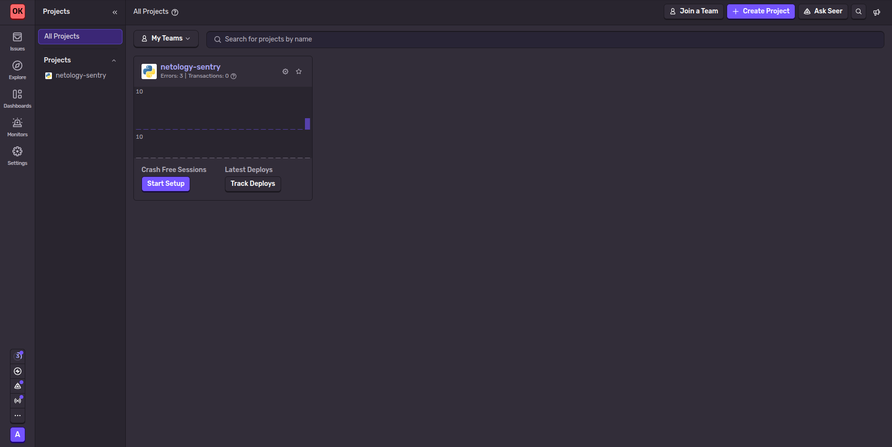
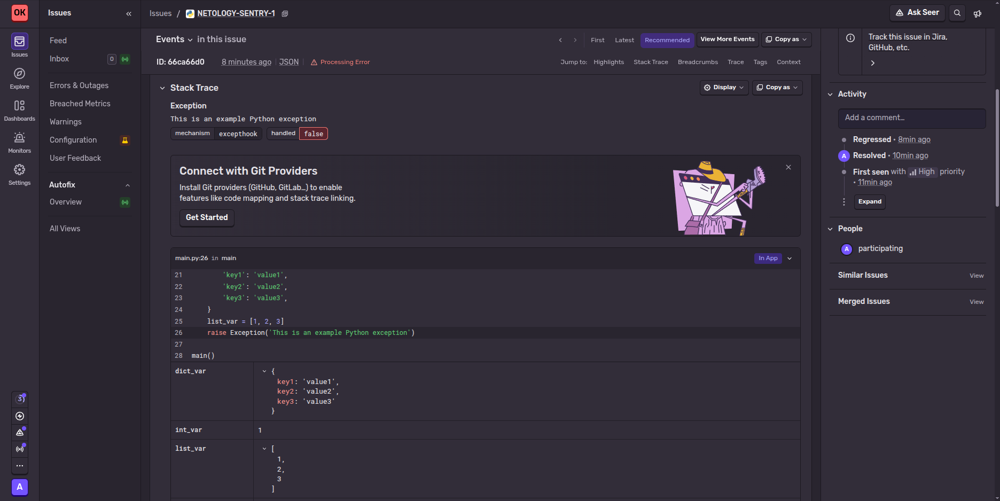
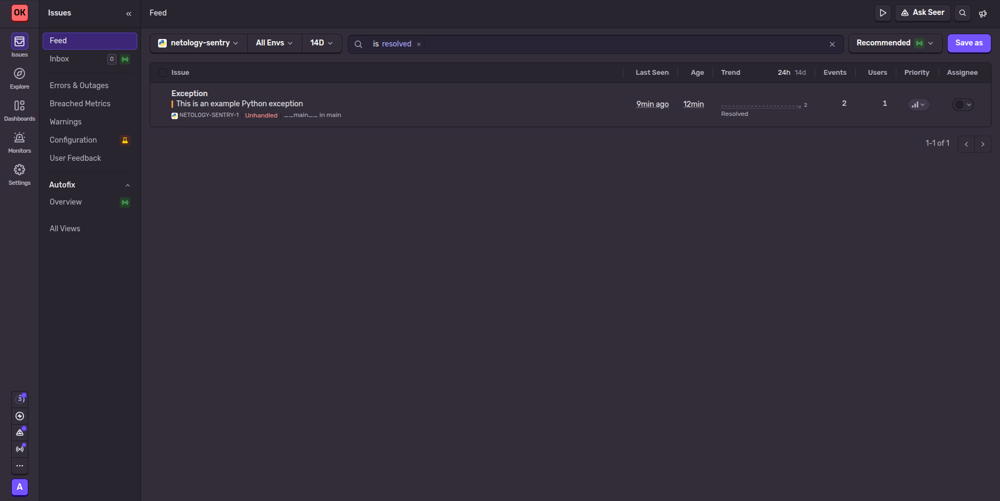
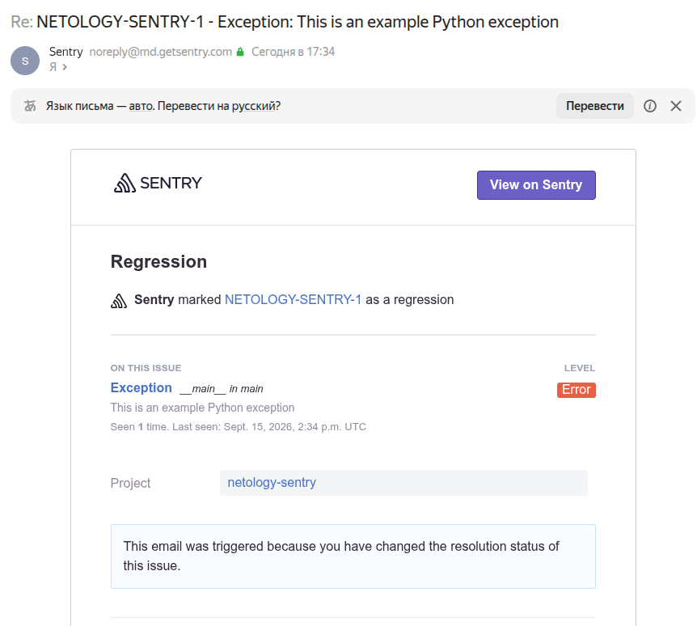
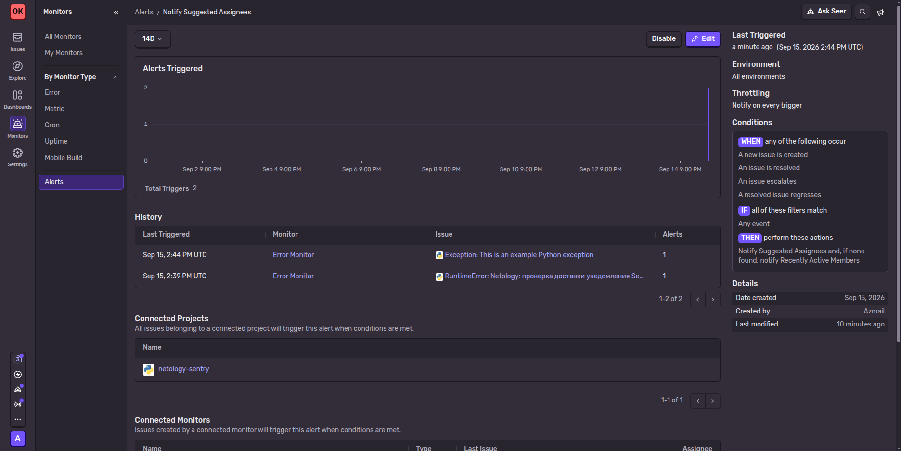
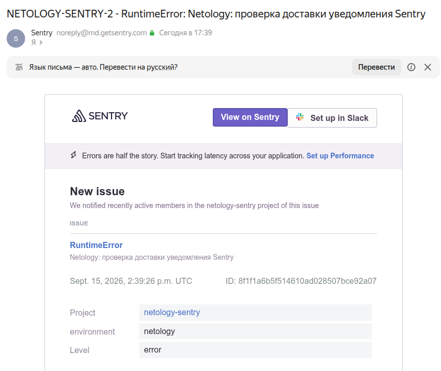

# Домашнее задание к занятию 16 «Платформа мониторинга Sentry»

## Задание 1. Проект в Sentry Cloud

Использовал Sentry Cloud с авторизацией через GitHub. Создал проект `netology-sentry`, платформа — **Python**. Репозиторий и дополнительные интеграции к проекту не подключал.

Проект в меню **Projects**:



## Задание 2. Тестовое событие и Resolved

Сгенерировал встроенное тестовое событие Python. В текущем интерфейсе вместо старой кнопки `Generate sample event` показывается настройка SDK, поэтому вызвал штатный endpoint генерации sample event. В Sentry появилась issue `NETOLOGY-SENTRY-1`:

```text
Exception: This is an example Python exception
```

В карточке посмотрел stack trace, переменные, breadcrumbs, сведения об окружении и HTTP-запросе:

- исключение возникло в `main.py`, строка 26, функция `main`;
- проблемная строка — `raise Exception('This is an example Python exception')`;
- ниже в стеке — вызов `main()` на строке 28;
- исключение необработанное: `handled: false`, механизм — `excepthook`;
- видны локальные переменные `dict_var`, `int_var`, `list_var` и `str_var`;
- в примере переданы окружение `production`, CPython 3.13.5 и тестовый HTTP-запрос.

Это данные встроенного примера, а не характеристики моего компьютера.



У sample event есть предупреждение **Invalid timestamp (too old)**: в заготовке осталась старая дата. Sentry скорректировал время события; само исключение и стек сохранились. Предупреждение на скриншоте не скрывал.

Нажал **Resolve**. После повторной генерации события при проверке уведомлений issue снова открылась как регрессия. В конце ещё раз перевёл её в `resolved` и проверил список с фильтром:

```text
is:resolved
```



В одной issue сгруппированы два одинаковых sample event. События при разрешении не удаляются — меняется статус проблемы.

## Задание 3. Правило алёртинга и письмо

В текущей версии Sentry правила находятся в **Monitors → Alerts**. При создании проекта уже появилось правило для high priority issues. Для задания создал отдельное правило **Notify Suggested Assignees**, без ограничения по приоритету.

В новом редакторе действие уведомления нужно выбрать явно. Выбрал **Notify on preferred channel**, остальные условия оставил предложенными редактором:

| Настройка | Значение |
| --- | --- |
| Проект | Только `netology-sentry` |
| Окружение | All environments |
| WHEN | Любой из стандартных триггеров: новая issue, разрешение, эскалация или регрессия |
| IF | `all`, без дополнительных фильтров — Any event |
| THEN | Suggested Assignees; если их нет — Recently Active Members |
| Канал действия | Email |
| Частота | Notify on every trigger |

### Повторное sample event

После сохранения правила снова сгенерировал sample event. Оно попало в ту же issue и вернуло её из `resolved` в `unresolved`. На почту пришло уведомление **Regression**:



В письме прямо указано, что уведомление связано с ранее изменённым статусом issue. Это уведомление участника, поэтому одного такого письма недостаточно, чтобы доказать работу отдельного правила.

### Проверка самого правила

Для проверки отправил через Python SDK одну реальную тестовую ошибку:

```text
RuntimeError: Netology: проверка доставки уведомления Sentry
```

Она появилась в проекте как `NETOLOGY-SENTRY-2`. В истории созданного правила зафиксировалось срабатывание на новую issue. Ещё одно срабатывание появилось после окончательного разрешения sample issue — это тоже один из стандартных триггеров.



В почте открыл уведомление **New issue**. В его теле указаны проект `netology-sentry`, окружение `netology`, уровень `error` и отправка недавно активным участникам проекта — это соответствует настроенному действию:



Таким образом, проверил всю цепочку: **Python → Sentry → правило алёртинга → письмо в почтовом ящике**. Отдельно проверены повторное sample event и переход issue обратно в `Resolved`.

## Код проверки

Код, которым отправлена реальная ошибка, сохранён в [alert_check.py](alert_check.py). Версия SDK зафиксирована в [requirements.txt](requirements.txt). DSN берётся из переменной окружения и в репозиторий не включён.

Для повторения проверки в своём проекте:

```bash
python3 -m venv .venv
source .venv/bin/activate
pip install -r requirements.txt
read -rs -p 'Sentry DSN: ' SENTRY_DSN; printf '\n'
export SENTRY_DSN
python alert_check.py
unset SENTRY_DSN
```

Каждый запуск отправляет одно событие. Передача стандартных персональных данных отключена; профилирование, трассировки и вложения для этой проверки не включались.

Краткая проверка API: [verification.json](evidence/verification.json).

Задание повышенной сложности отдельно не выполнял: SDK здесь использован для проверки уведомления, без серии экспериментов с несколькими видами событий.
