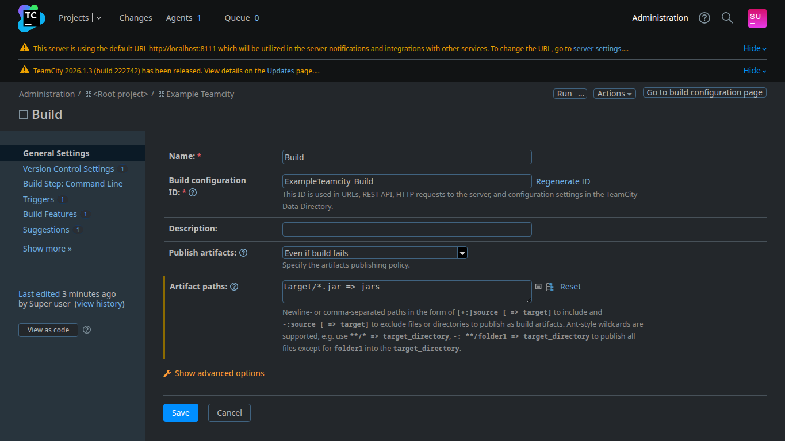
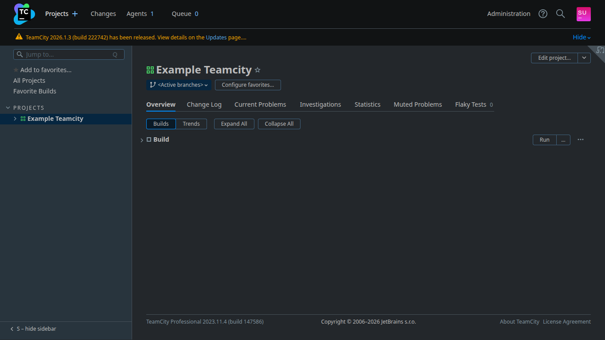
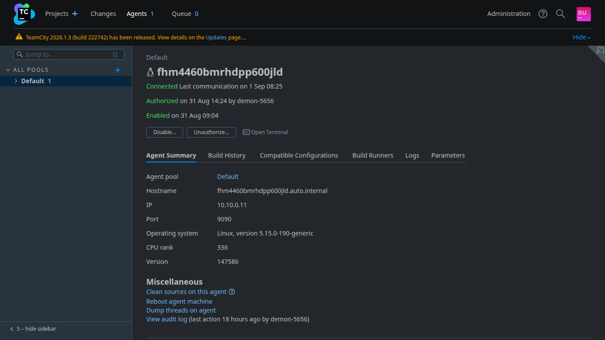
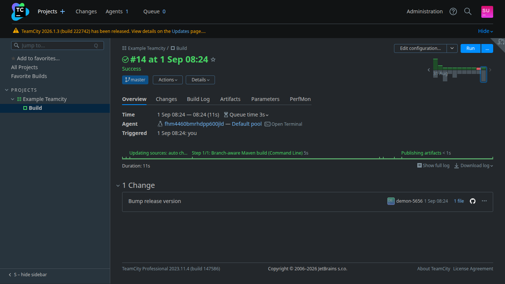
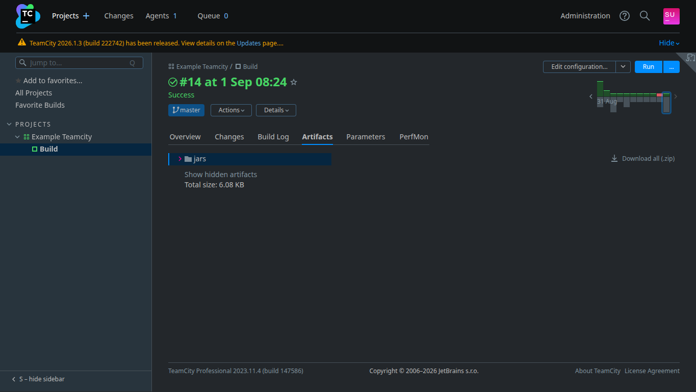
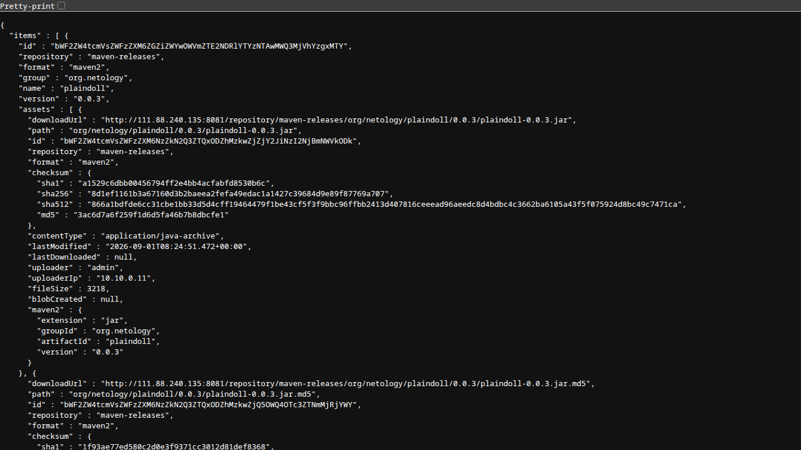

# Домашнее задание к занятию 11 «TeamCity»

В работе настроен учебный проект `plaindoll`: сборка запускается от VCS-триггера, для feature-веток выполняются тесты, а `master` публикуется в Nexus. Конфигурация TeamCity хранится в репозитории через Kotlin DSL.

## Ссылки

Папки с работой:

- [`example-teamcity`](example-teamcity) — fork проекта, исходники, тесты и Kotlin DSL;
- [`example-teamcity/.teamcity`](example-teamcity/.teamcity) — versioned configuration TeamCity;
- [`example-teamcity/teamcity`](example-teamcity/teamcity) — шаблон Maven settings;
- [`evidence`](evidence) — результаты локальных проверок;
- [`screenshots`](screenshots) — скриншоты стенда.

Fork на GitHub:

- <https://github.com/demon-5656/example-teamcity>

Для отправки в ЛК:

```text
https://github.com/demon-5656/Tasks/blob/main/netology/teamcity-01/REPORT.md
```

## Что сделано

В fork проекта добавлен метод `Welcomer.sayReply()`. Он возвращает реплику со словом `hunter`:

```java
public String sayReply() {
    return "A hunter must keep moving forward.";
}
```

Для него добавлен тест:

```java
@Test
public void welcomerReplyContainsHunter() {
    assertThat(welcomer.sayReply(), containsString("hunter"));
}
```

Ветка `feature/add_reply` влита в `master` merge-коммитом [`90c548c`](https://github.com/demon-5656/example-teamcity/commit/90c548cf11b858842d30c143372238d35c66c967).

## Конфигурация TeamCity

В [`example-teamcity/.teamcity/settings.kts`](example-teamcity/.teamcity/settings.kts) сохранена versioned configuration:

- VCS trigger запускает сборку после push;
- в шаге сборки стоит простая проверка ветки;
- для `master` выполняется `mvn clean deploy`;
- для остальных веток выполняется `mvn clean test`;
- deploy использует Maven settings с доступом к Nexus;
- артефакты сборки: `target/*.jar => jars`.

Шаблон Maven settings находится в [`example-teamcity/teamcity/settings.xml.template`](example-teamcity/teamcity/settings.xml.template). В сам TeamCity был загружен рабочий `settings.xml` с доступом к Nexus, но в Git я его не кладу. Иначе пароль уедет в историю репозитория, а это потом неприятно чистить.

Конфигурация добавлена в репозиторий коммитом [`4615a78`](https://github.com/demon-5656/example-teamcity/commit/4615a78cb6a6554f14409bdb73a0e6747ae8b95d). После проверки на стенде поправил правило артефактов и сам branch-aware шаг коммитом [`6b33025`](https://github.com/demon-5656/example-teamcity/commit/6b33025).

Настройки build configuration на площадке:



## Проверки

### Локальная сборка

```bash
mvn clean test
```

Результат:

```text
[INFO] Running plaindoll.WelcomerTest
[INFO] Tests run: 6, Failures: 0, Errors: 0, Skipped: 0
[INFO] BUILD SUCCESS
```

Короткий вывод: [`evidence/maven-test-summary.txt`](evidence/maven-test-summary.txt).

До этого ещё проверял проект обычной Java-сборкой, чтобы не упираться в окружение Maven:

```text
All Welcomer checks passed
```

Полный вывод: [`evidence/01_local_build.txt`](evidence/01_local_build.txt).

### Конфигурационные файлы

`pom.xml` и `teamcity/settings.xml.template` проверены XML-парсером:

```text
XML validation passed
```

Файл: [`evidence/02_xml_validation.txt`](evidence/02_xml_validation.txt).

## Стенд TeamCity

Для работы был поднят отдельный стенд в Yandex Cloud: TeamCity Server, Build Agent и VM с Nexus. Первый запуск TeamCity:


TeamCity открывается в браузере, агент подключен к серверу:





После push в `master` поднял версию проекта до `0.0.3`. На `0.0.2` Nexus закономерно ругался на повторную публикацию в `maven-releases`, потому что release-репозиторий не разрешает перезаписывать уже загруженные файлы.

Сборка `#14` прошла успешно:



В TeamCity появились артефакты сборки:



Файлы артефактов проверил через REST:

```text
original-plaindoll-0.0.3.jar
plaindoll-0.0.3.jar
```

Файл: [`evidence/04_teamcity_artifacts_14.xml`](evidence/04_teamcity_artifacts_14.xml).

Публикация в Nexus тоже прошла. В репозитории `maven-releases` есть `org.netology:plaindoll:0.0.3`:



Файл с ответом Nexus: [`evidence/05_nexus_plaindoll_003.json`](evidence/05_nexus_plaindoll_003.json).

В логе TeamCity видно, что для `master` выполнился именно `clean deploy`, прошли тесты и была публикация артефактов:

```text
if [ "master" = "master" ]; then ... mvn -s /opt/buildagent/conf/settings.xml clean deploy
Tests run: 6, Failures: 0, Errors: 0, Skipped: 0
Uploading to nexus: .../plaindoll/0.0.3/plaindoll-0.0.3.jar
Publishing artifacts
```

Файл: [`evidence/06_teamcity_build_14_log.txt`](evidence/06_teamcity_build_14_log.txt).
