# Итоговый проект модуля «Облачная инфраструктура. Terraform»

Для итогового проекта использовано приложение [`legacy-100-years`](https://github.com/demon-5656/legacy-100-years). Это web-приложение с frontend, backend, авторизацией пользователей, подтверждением почты, восстановлением пароля и сохранением игрового прогресса в MySQL.

Такой вариант выбран, потому что для него нужна полноценная инфраструктура: VM, Docker, Container Registry, managed database, переменные окружения и хранение секретов.

## Состав решения

- VPC и две подсети в Yandex Cloud;
- security groups для приложения и MySQL;
- VM для запуска приложения;
- установка Docker и Docker Compose через `cloud-init`;
- Yandex Managed MySQL;
- Yandex Container Registry;
- Lockbox для секретов приложения;
- remote state в Object Storage с lock-файлом;
- Docker Compose для запуска frontend/backend контейнеров;
- подключение backend к Managed MySQL.

Terraform-код находится в каталоге [`src`](src).

## Результат запуска

Инфраструктура развернута в Yandex Cloud через Terraform.

Публичный адрес приложения:

```text
http://93.77.190.156
```

Основные outputs:

```text
app_url      = "http://93.77.190.156"
registry_url = "cr.yandex/crp0il81r01irlk6s76q"
mysql_host   = "rc1b-881et6a4m3dbnncs.mdb.yandexcloud.net"
```

Финальная проверка Terraform:

```text
No changes. Your infrastructure matches the configuration.
```

Файл с выводом: [`evidence/50_terraform_plan_no_changes_final.txt`](evidence/50_terraform_plan_no_changes_final.txt).

## Архитектура

```text
Пользователь
    |
    | HTTP
    v
VM в Yandex Cloud
    |
    | Docker Compose
    v
nginx container -> api container
                    |
                    | MySQL 3306
                    v
              Yandex Managed MySQL

Container Registry хранит Docker-образы web/api.
Lockbox хранит пароль БД, JWT secret и SMTP password.
Terraform state хранится в Object Storage.
```

Скриншот открытого приложения:

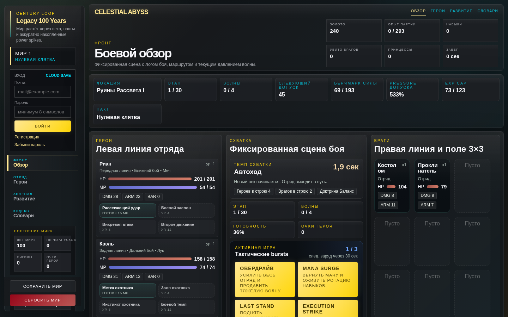

## Задание 1. Инфраструктура в Yandex Cloud

VPC описана ресурсом `yandex_vpc_network`:

```hcl
resource "yandex_vpc_network" "app" {
  name = "${var.app_name}-vpc"
}
```

Подсети создаются через `for_each`:

```hcl
resource "yandex_vpc_subnet" "this" {
  for_each = var.subnets

  name           = "${var.app_name}-${each.key}"
  zone           = each.value.zone
  network_id     = yandex_vpc_network.app.id
  v4_cidr_blocks = [each.value.cidr]
}
```

В конфигурации используются две подсети:

- `app-a` для VM с приложением;
- `db-b` для Managed MySQL.

Для VM открыты порты:

- `22` для SSH;
- `80` для HTTP;
- `443` для HTTPS.

Для MySQL открыт порт `3306` только от security group приложения. База не доступна напрямую из интернета.

Файлы:

- [`src/network.tf`](src/network.tf);
- [`src/compute.tf`](src/compute.tf);
- [`src/mysql.tf`](src/mysql.tf);
- [`src/registry.tf`](src/registry.tf).

Проверка ресурсов в Yandex Cloud:

- VM: [`evidence/51_yc_compute_instances_final.txt`](evidence/51_yc_compute_instances_final.txt);
- MySQL: [`evidence/52_yc_mysql_clusters_final.txt`](evidence/52_yc_mysql_clusters_final.txt);
- Container Registry: [`evidence/53_yc_container_registries_final.txt`](evidence/53_yc_container_registries_final.txt);
- Lockbox: [`evidence/55_yc_lockbox_secrets_final.txt`](evidence/55_yc_lockbox_secrets_final.txt);
- Object Storage bucket для state: [`evidence/56_yc_storage_buckets_final.txt`](evidence/56_yc_storage_buckets_final.txt).

## Задание 2. Установка Docker через cloud-init

VM создается ресурсом `yandex_compute_instance`. В `metadata.user-data` передается шаблон [`src/templates/cloud-init.yml`](src/templates/cloud-init.yml).

Cloud-init выполняет:

```text
1. создание пользователя ubuntu;
2. добавление SSH-ключа;
3. установку Docker CE;
4. установку docker compose plugin;
5. создание runtime `.env`;
6. запись `docker-compose.cloud.yml`;
7. вход в Container Registry через IAM-токен;
8. запуск контейнеров из опубликованных образов.
```

Runtime `.env` создается на сервере и содержит настройки подключения к MySQL, SMTP и параметры приложения. В Git хранится только пример файла с переменными, реальные значения исключены из репозитория.

После запуска VM cloud-init завершился без ошибок, контейнеры поднялись:

```text
legacy-100-years-web-1
legacy-100-years-api-1
```

Файл проверки: [`evidence/41_vm_cloud_init_docker_final.txt`](evidence/41_vm_cloud_init_docker_final.txt).

## Задание 3. Dockerfile и Container Registry

В приложении используется multi-stage [`Dockerfile`](https://github.com/demon-5656/legacy-100-years/blob/main/Dockerfile):

- `deps` устанавливает npm-зависимости;
- `frontend-build` собирает React/Vite frontend;
- `web` формирует nginx-образ со статикой;
- `api` формирует Node.js backend-образ.

Локальная сборка образов:

```bash
docker build --target web -t legacy-100-years-web:local .
docker build --target api -t legacy-100-years-api:local .
```

Container Registry создается ресурсом:

```hcl
resource "yandex_container_registry" "app" {
  name = local.registry_name
}
```

После создания registry адрес доступен через output:

```bash
terraform -chdir=src output -raw registry_url
```

Пример публикации образов:

```bash
export CR_REGISTRY="$(terraform -chdir=src output -raw registry_url)"

docker tag legacy-100-years-web:local "$CR_REGISTRY/legacy-100-years-web:latest"
docker tag legacy-100-years-api:local "$CR_REGISTRY/legacy-100-years-api:latest"

docker push "$CR_REGISTRY/legacy-100-years-web:latest"
docker push "$CR_REGISTRY/legacy-100-years-api:latest"
```

Образы загружены в Yandex Container Registry:

- [`evidence/54_yc_container_images_final.txt`](evidence/54_yc_container_images_final.txt).

При подготовке Dockerfile я опирался на несколько обычных практик, которые реально помогают не раздувать контейнеры:

- базовые образы взяты минимальные: `node:22-alpine` для сборки/backend и `nginx:1.27-alpine` для web;
- зависимости копируются отдельно от исходного кода: сначала `package*.json`, затем `npm ci`, чтобы Docker мог нормально использовать кэш слоев;
- используется multi-stage сборка: тяжелая сборочная часть остается в промежуточном слое, а в финальный web-образ попадает только готовая статика;
- в `.dockerignore` исключены `.env`, `node_modules`, сборочные каталоги, git-метаданные и результаты тестов;
- в Dockerfile используется `COPY`, а не `ADD`, потому здесь не нужно автоматическое распаковывание архивов или скачивание URL;
- секреты не передаются через `ARG` и не запекаются в образ. Пароли и токены попадают в приложение только на этапе запуска через env, а исходные значения хранятся отдельно от Git.

Для промышленной эксплуатации поверх этого стоит добавить закрепление базовых образов по digest вместо `latest`, запуск backend не от root-пользователя, `HEALTHCHECK` для контейнеров и проверку Dockerfile через `hadolint`.

## Задание 4. Подключение приложения к БД

Managed MySQL описан в [`src/mysql.tf`](src/mysql.tf). Создаются:

- MySQL cluster;
- база данных `legacy_100_years`;
- пользователь приложения;
- права пользователя на базу.

Backend получает подключение через переменные окружения:

```text
MYSQL_HOST
MYSQL_PORT
MYSQL_DATABASE
MYSQL_USER
MYSQL_PASSWORD
MYSQL_SSL
```

При старте backend создает таблицы приложения:

- `users`;
- `email_verification_tokens`;
- `password_reset_tokens`;
- `game_saves`.

Terraform в этом решении управляет инфраструктурой и managed database, а схема приложения создается самим backend. Для такого небольшого проекта это упрощает запуск и не требует отдельного миграционного сервиса.

Проверка API:

```bash
curl http://93.77.190.156/api/health
```

Ответ:

```json
{"ok":true}
```

Файл: [`evidence/57_app_health_final.json`](evidence/57_app_health_final.json).

Проверка сохранения прогресса:

- регистрация пользователя: [`evidence/43_register_response.json`](evidence/43_register_response.json);
- подтверждение почты: [`evidence/46_verify_response_masked.json`](evidence/46_verify_response_masked.json);
- сохранение прогресса: [`evidence/47_save_response.json`](evidence/47_save_response.json);
- чтение прогресса из MySQL: [`evidence/48_load_save_response.json`](evidence/48_load_save_response.json).

## Задание 5*. Lockbox

Для секретов добавлен Yandex Lockbox:

```hcl
resource "yandex_lockbox_secret" "app" {
  name = "${var.app_name}-secrets"
}
```

В Lockbox сохраняются:

- `mysql_password`;
- `jwt_secret`;
- `smtp_password`.

Файл: [`src/lockbox.tf`](src/lockbox.tf).

Значения секретов передаются в Terraform через локальный `personal.auto.tfvars`, который исключен из Git. В репозитории оставлен только пример [`src/personal.auto.tfvars.example`](src/personal.auto.tfvars.example).

## Remote state

Backend настроен на Object Storage:

```hcl
backend "s3" {
  key    = "terraform-final/terraform.tfstate"
  region = "ru-central1"

  endpoints = {
    s3 = "https://storage.yandexcloud.net"
  }

  use_lockfile = true
}
```

Файл: [`src/providers.tf`](src/providers.tf).

Настоящий `backend.hcl` с ключами доступа исключен из Git. В репозитории есть только шаблон [`src/backend.hcl.example`](src/backend.hcl.example).

## Проверки

Выполнены базовые проверки Terraform:

```bash
terraform -chdir=src fmt -check -recursive
terraform -chdir=src init -backend=false
terraform -chdir=src validate
```

Результаты:

- [`evidence/01_terraform_fmt.txt`](evidence/01_terraform_fmt.txt);
- [`evidence/02_terraform_init_backend_false.txt`](evidence/02_terraform_init_backend_false.txt);
- [`evidence/03_terraform_validate.txt`](evidence/03_terraform_validate.txt).
- [`evidence/05_terraform_init_remote_state.txt`](evidence/05_terraform_init_remote_state.txt);
- [`evidence/20_terraform_apply_lockbox_fix.txt`](evidence/20_terraform_apply_lockbox_fix.txt);
- [`evidence/32_terraform_apply_recreate_vm.txt`](evidence/32_terraform_apply_recreate_vm.txt);
- [`evidence/39_terraform_apply_recreate_vm_after_compose_embed.txt`](evidence/39_terraform_apply_recreate_vm_after_compose_embed.txt);
- [`evidence/50_terraform_plan_no_changes_final.txt`](evidence/50_terraform_plan_no_changes_final.txt).

Приложение:

- репозиторий: [`demon-5656/legacy-100-years`](https://github.com/demon-5656/legacy-100-years);
- commit приложения: [`evidence/00_app_repo_commit.txt`](evidence/00_app_repo_commit.txt).

## Скриншоты

- 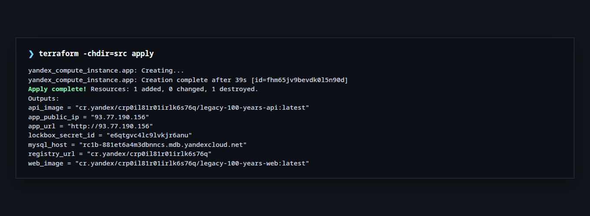
- 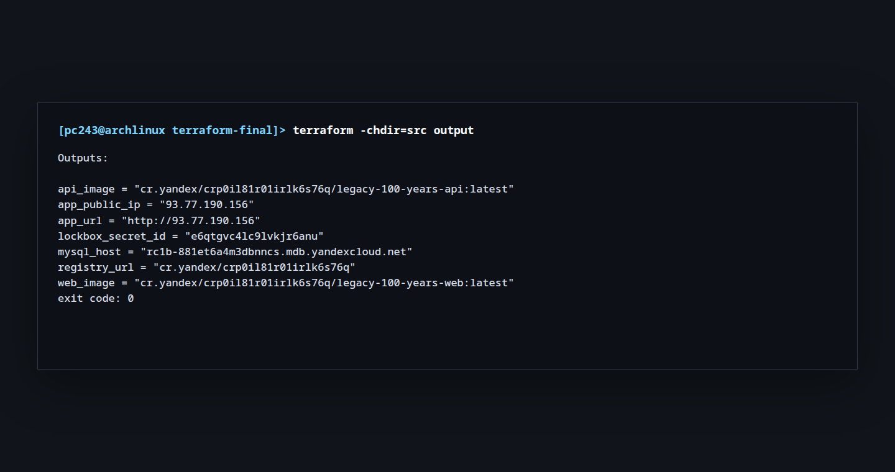
- 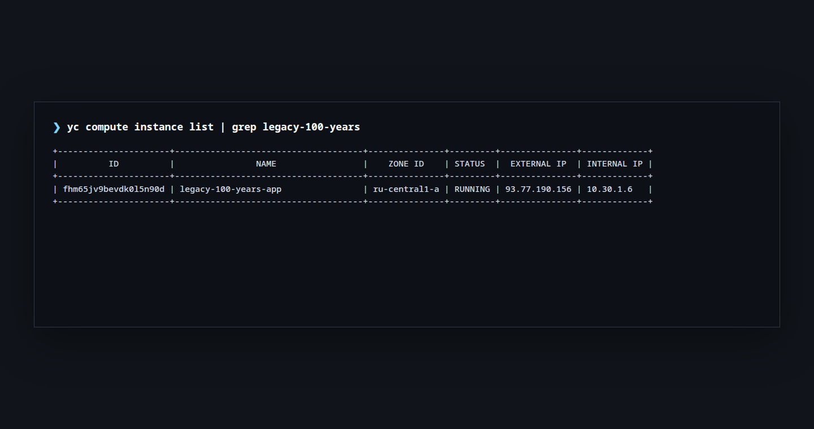
- 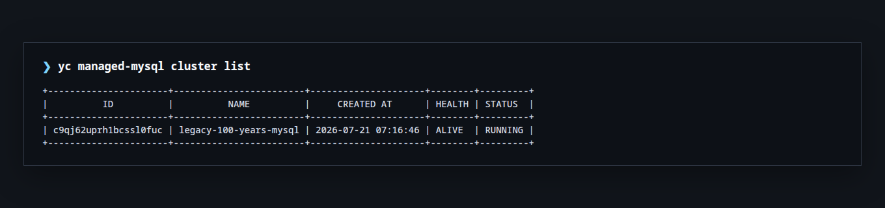
- 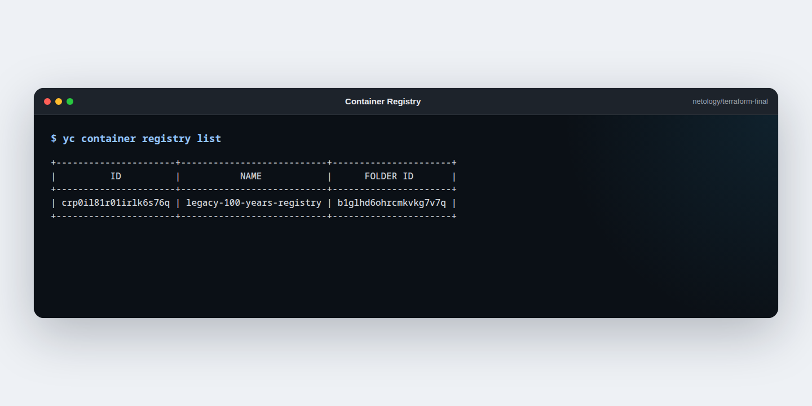
- 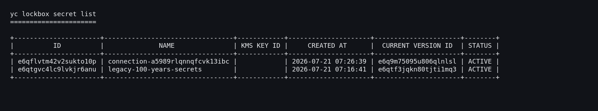
- 
- 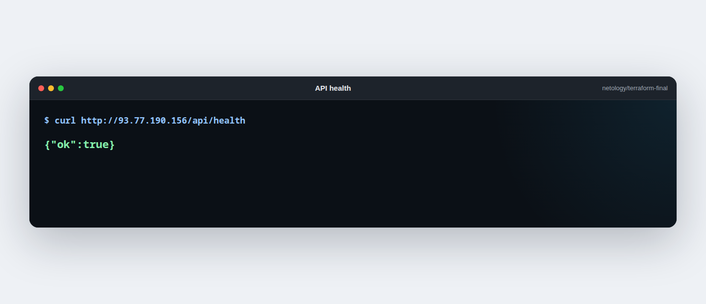
- 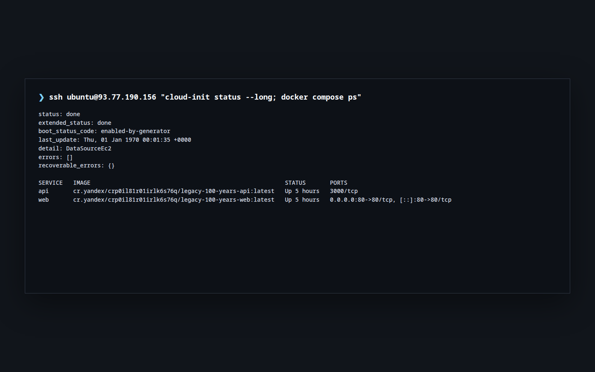
- 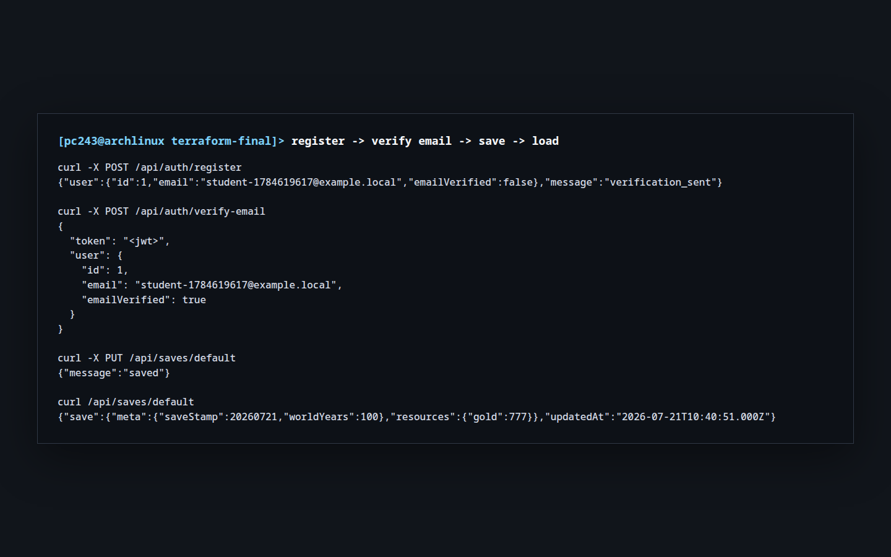
- 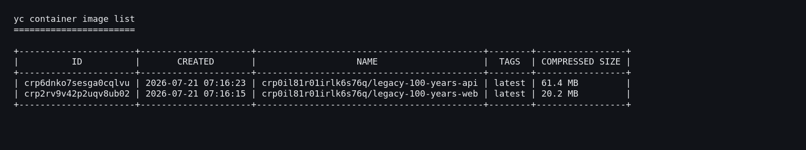
- 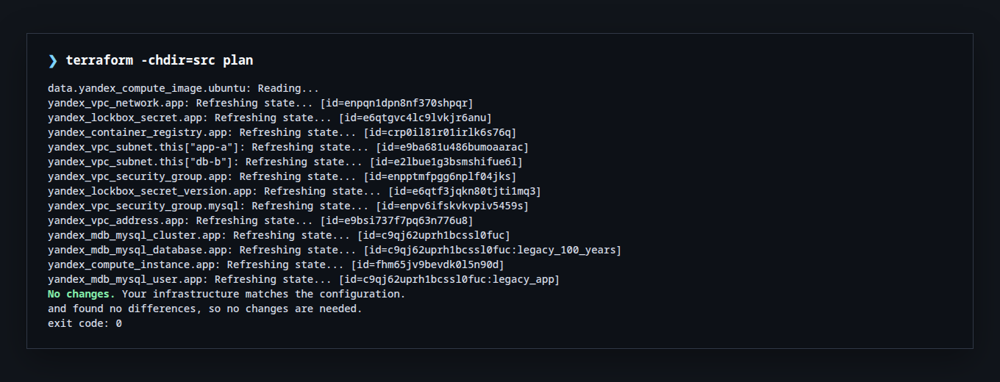
